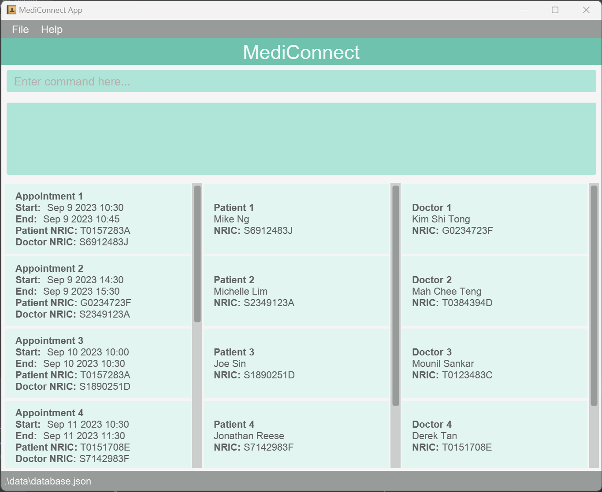

* This is **a project based on a sample project for Software Engineering (SE) students**.
* It is named `MediConnect` because the target user receptionist at medical facilities.
* The purpose of `MediConnect` is to aid receptionist in their day-to-day administrative task. 
  This includes:
  * Helping a patient book their next appointment.
  * Helping a doctor retrieve the medical history of a particular patient.
* The project simulates an ongoing software project for a desktop application (called _MediConnect_) used for managing patient details, doctor details and, appointments.
  * It is **written in OOP fashion**.
  * It comes with a **reasonable level of user and developer documentation**.
* For an overview of this project, see the **[MediConnect Product Website](https://ay2324s1-cs2103t-t08-1.github.io/tp/)**.
* This project is based on `AddressBook Level 3` project (`AB3` for short), a **part of the se-education.org** initiative.
  * Documentation of `AB3`: **[Address Book Product Website](https://se-education.org/addressbook-level3)**.
