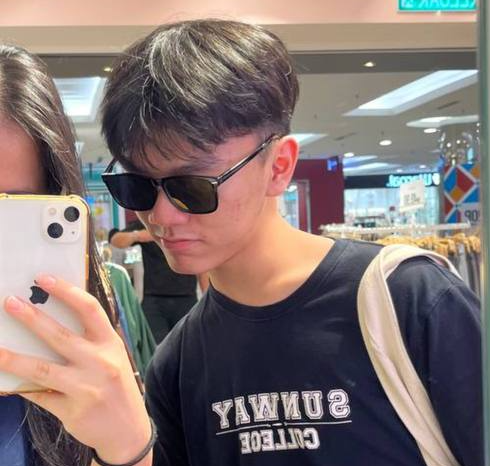

We are a team based in the [School of Computing, National University of Singapore](http://www.comp.nus.edu.sg).

## CS2103T-T08-1

### Kim Shi Tong

[[github](https://github.com/kimshitong)]
[[portfolio](team/kimshitong.md)]

* Role: Developer
* Responsibilities: UI + Threading

### Mah Chee Teng

[[github](http://github.com/cheeggered)]
[[portfolio](team/cheeggered.md)]

* Role: Developer
* Responsibilities: UI + Data

### Mounil Sankar

[[github](http://github.com/mounilsankar)] 
[[portfolio](team/mounilsankar.md)]

* Role: Developer
* Responsibilities: Data

### Tan Jing Xu, Derek

[[github](http://github.com/derekjxtan)]
[[portfolio](team/derekjxtan.md)]

* Role: Developer
* Responsibilities: Dev Ops + Threading

### Tang Yang Heng

[[github](http://github.com/yanghengtang)]
[[portfolio](team/yanghengtang.md)]

* Role: Developer
* Responsibilities: Dev Ops + Data
