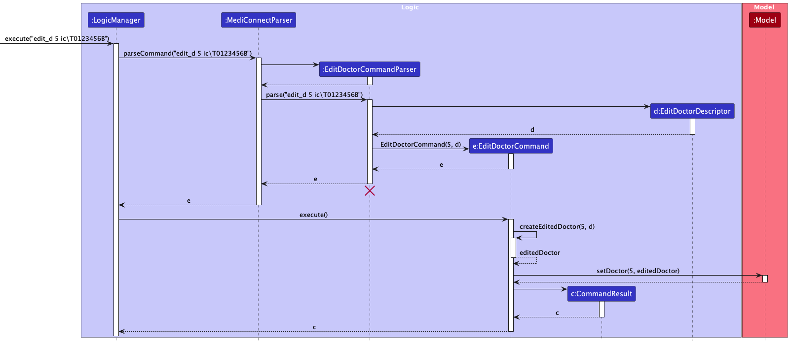
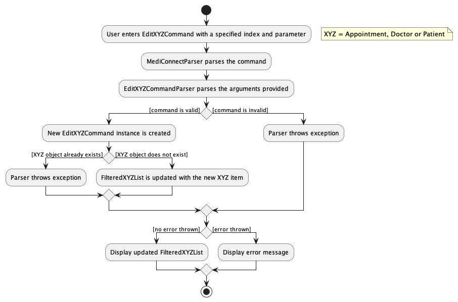
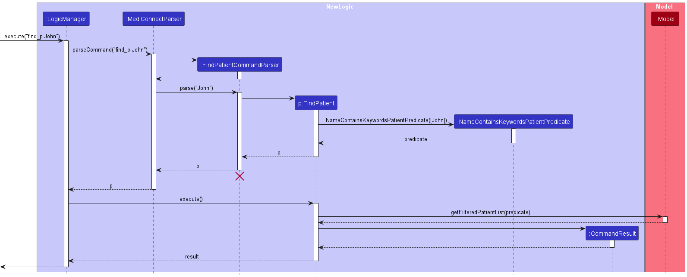
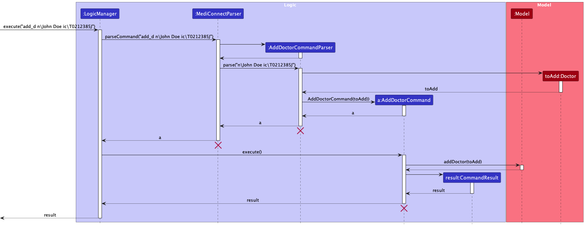

* Table of Contents
{:toc}

--------------------------------------------------------------------------------------------------------------------

## **Acknowledgements**

* {list here sources of all reused/adapted ideas, code, documentation, and third-party libraries -- include links to the original source as well}

--------------------------------------------------------------------------------------------------------------------

## **Setting up, getting started**

Refer to the guide [_Setting up and getting started_](SettingUp.md).

--------------------------------------------------------------------------------------------------------------------

## **Design**

:bulb: **Tip:** The `.puml` files used to create diagrams in this document `docs/diagrams` folder. Refer to the [_PlantUML Tutorial_ at se-edu/guides](https://se-education.org/guides/tutorials/plantUml.html) to learn how to create and edit diagrams.

### Architecture

The ***Architecture Diagram*** given above explains the high-level design of the App.

Given below is a quick overview of main components and how they interact with each other.

**Main components of the architecture**

**`Main`** (consisting of classes [`Main`](https://github.com/se-edu/addressbook-level3/tree/master/src/main/java/seedu/address/Main.java) and [`MainApp`](https://github.com/se-edu/addressbook-level3/tree/master/src/main/java/seedu/address/MainApp.java)) is in charge of the app launch and shut down.
* At app launch, it initializes the other components in the correct sequence, and connects them up with each other.
* At shut down, it shuts down the other components and invokes cleanup methods where necessary.

The bulk of the app's work is done by the following four components:

* [**`UI`**](#ui-component): The UI of the App.
* [**`Logic`**](#logic-component): The command executor.
* [**`Model`**](#model-component): Holds the data of the App in memory.
* [**`Storage`**](#storage-component): Reads data from, and writes data to, the hard disk.

[**`Commons`**](#common-classes) represents a collection of classes used by multiple other components.

**How the architecture components interact with each other**

The *Sequence Diagram* below shows how the components interact with each other for the scenario where the user issues the command `delete 1`.

Each of the four main components (also shown in the diagram above),

* defines its *API* in an `interface` with the same name as the Component.
* implements its functionality using a concrete `{Component Name}Manager` class (which follows the corresponding API `interface` mentioned in the previous point.

For example, the `Logic` component defines its API in the `Logic.java` interface and implements its functionality using the `LogicManager.java` class which follows the `Logic` interface. Other components interact with a given component through its interface rather than the concrete class (reason: to prevent outside component's being coupled to the implementation of a component), as illustrated in the (partial) class diagram below.

The sections below give more details of each component.

### UI component

The **API** of this component is specified in [`Ui.java`](https://github.com/se-edu/addressbook-level3/tree/master/src/main/java/seedu/address/ui/Ui.java)

The UI consists of a `MainWindow` that is made up of parts e.g.`CommandBox`, `ResultDisplay`, `PersonListPanel`, `StatusBarFooter` etc. All these, including the `MainWindow`, inherit from the abstract `UiPart` class which captures the commonalities between classes that represent parts of the visible GUI.

The `UI` component uses the JavaFx UI framework. The layout of these UI parts are defined in matching `.fxml` files that are in the `src/main/resources/view` folder. For example, the layout of the [`MainWindow`](https://github.com/se-edu/addressbook-level3/tree/master/src/main/java/seedu/address/ui/MainWindow.java) is specified in [`MainWindow.fxml`](https://github.com/se-edu/addressbook-level3/tree/master/src/main/resources/view/MainWindow.fxml)

The `UI` component,

* executes user commands using the `Logic` component.
* listens for changes to `Model` data so that the UI can be updated with the modified data.
* keeps a reference to the `Logic` component, because the `UI` relies on the `Logic` to execute commands.
* depends on some classes in the `Model` component, as it displays `Person` object residing in the `Model`.

### Logic component

**API** : [`Logic.java`](https://github.com/se-edu/addressbook-level3/tree/master/src/main/java/seedu/address/logic/Logic.java)

Here's a (partial) class diagram of the `Logic` component:

The sequence diagram below illustrates the interactions within the `Logic` component, taking `execute("delete 1")` API call as an example.

:information_source: **Note:** The lifeline for `DeleteCommandParser` should end at the destroy marker (X) but due to a limitation of PlantUML, the lifeline reaches the end of diagram.

How the `Logic` component works:

1. When `Logic` is called upon to execute a command, it is passed to an `AddressBookParser` object which in turn creates a parser that matches the command (e.g., `DeleteCommandParser`) and uses it to parse the command.
1. This results in a `Command` object (more precisely, an object of one of its subclasses e.g., `DeleteCommand`) which is executed by the `LogicManager`.
1. The command can communicate with the `Model` when it is executed (e.g. to delete a person).
1. The result of the command execution is encapsulated as a `CommandResult` object which is returned back from `Logic`.

Here are the other classes in `Logic` (omitted from the class diagram above) that are used for parsing a user command:

How the parsing works:
* When called upon to parse a user command, the `AddressBookParser` class creates an `XYZCommandParser` (`XYZ` is a placeholder for the specific command name e.g., `AddCommandParser`) which uses the other classes shown above to parse the user command and create a `XYZCommand` object (e.g., `AddCommand`) which the `AddressBookParser` returns back as a `Command` object.
* All `XYZCommandParser` classes (e.g., `AddCommandParser`, `DeleteCommandParser`, ...) inherit from the `Parser` interface so that they can be treated similarly where possible e.g, during testing.

### Model component
**API** : [`Model.java`](https://github.com/se-edu/addressbook-level3/tree/master/src/main/java/seedu/address/model/Model.java)

The `Model` component,

* stores the address book data i.e., all `Person` objects (which are contained in a `UniquePersonList` object).
* stores the currently 'selected' `Person` objects (e.g., results of a search query) as a separate _filtered_ list which is exposed to outsiders as an unmodifiable `ObservableList<Person>` that can be 'observed' e.g. the UI can be bound to this list so that the UI automatically updates when the data in the list change.
* stores a `UserPref` object that represents the user’s preferences. This is exposed to the outside as a `ReadOnlyUserPref` objects.
* does not depend on any of the other three components (as the `Model` represents data entities of the domain, they should make sense on their own without depending on other components)

:information_source: **Note:** An alternative (arguably, a more OOP) model is given below. It has a `Tag` list in the `AddressBook`, which `Person` references. This allows `AddressBook` to only require one `Tag` object per unique tag, instead of each `Person` needing their own `Tag` objects. 

### Storage component

**API** : [`Storage.java`](https://github.com/se-edu/addressbook-level3/tree/master/src/main/java/seedu/address/storage/Storage.java)

The `Storage` component,
* can save both address book data and user preference data in JSON format, and read them back into corresponding objects.
* inherits from both `AddressBookStorage` and `UserPrefStorage`, which means it can be treated as either one (if only the functionality of only one is needed).
* depends on some classes in the `Model` component (because the `Storage` component's job is to save/retrieve objects that belong to the `Model`)

### Common classes

Classes used by multiple components are in the `seedu.addressbook.commons` package.

--------------------------------------------------------------------------------------------------------------------

## **Implementation**

This section describes some noteworthy details on how certain features are implemented.

### Edit patient feature

#### Implementation

The proposed edit patient mechanism is facilitated by `EditPatientCommand` and it extends `Model`. Additionally, it implements the following operations:

* `LogicManager#execute()` —  Executes the given user String input and returns a 'CommandResult'

Given below is an example usage scenario and how the edit patient mechanism behaves at each step.

Step 1. The user launches the application. The `Database` will be initialized with all data in the order that it was stored in.

Step 2. The user inputs `edit_p 5 p\23456789` command to edit the phone number of the 5th patient in the MediConnect database. The `edit_p` command calls `EditCommandParser#parse()` which parses the parameters to edit the current patient with. 
A new `EditPatientDescriptor` instance will be created in the parse command call, and a new `EditPatientCommand` instance will be created with the `EditPatientDescriptor` and the given `index`.

Step 3. The created `EditPatientCommand` instance is returned to `LogicManager` and its `execute` method is called.
`EditPatientCommand#execute` then calls `Model#setPatient` and with the patient of the given `Index` and the target patient created by the `EditPatientDescriptor`.

The example usage scenario for the edit doctor and edit appointment mechanisms would be very similar to the above scenario.

:information_source: **Note:** If a command fails its execution, it will not call `Model#setPatient()`, so the database will not be updated.

The following sequence diagram shows how the edit appointment operation would work:

The following sequence diagram shows how the edit doctor operation would work:

The following sequence diagram shows how the edit patient operation would work:

The following activity diagram summarizes what happens when a user wants to edit an appointment/patient/doctor:

#### Design considerations:

**Aspect: How edit patient executes:** 

* **Alternative 1 (current choice):** Having a single EditPatientCommand class that can edit all patient attributes
    * Pros: Better scalability.
    * Cons: Increase coupling due to the usage of Optional class.

* **Alternative 2:** Creating a command class for each patient attribute (eg. EditPatientNameCommand)
    * Pros: Straightforward, no need to handle optional parameters 
    * Cons: Limited scalability, have to implement new command classes when attributes are added to 
    patient/doctor/appointment classes

_{more aspects and alternatives to be added}_

## **Implementation**

This section describes some noteworthy details on how certain features are implemented.

### Find Doctor / Patient

**Introduction**

This section describes the feature that allows users to find doctors/patient in the MediConnect database by name.

#### Implementation
The finding of a doctor/patient in MediConnect is facilitated by LogicManager, which extends Logic. It holds a mediConnectParser that parses the user input, and a Model where the command is executed. Key methods involved include:

LogicManager#execute() — Executes the given user String input and returns a CommandResult
FindDoctorCommandParser/FindPatientCommandParser#parse() — Parses the user input to create a FindDoctorCommand/FindPatientCommand
FindDoctorCommand/FindPatientCommand#execute() — Filters the list of doctors/patient based on the given predicate
These operations are exposed in the Ui interface as Ui#executeCommand().

Given below is an example usage scenario and how the ListDoctorCommand/ListPatientCommand mechanism behaves at each step.

Step 1: The user inputs find_d/find_n John to search for doctors/patients named "John" in MediConnect.
* The find_d/find_n command triggers mediConnectParser#parseCommand, which identifies the command word and calls FindDoctorCommandParser/FindPatientCommandParser#parse to handle the arguments.

Step 2: The FindDoctorCommandParser/FindPatientCommandParser#parse method splits the argument "John" into a list of keywords. It then creates a NameContainsKeywordsDoctorPredicate/NameContainsKeywordsPatientPredicate object, using the list of keywords.

Step 3: A new FindDoctorCommand/FindPatientCommand instance is created using the NameContainsKeywordsDoctorPredicate/NameContainsKeywordsPatientPredicate object.

Step 4: The created FindDoctorCommand/FindPatientCommand instance is returned to LogicManager, and its execute method is called.
FindDoctorCommand/FindPatientCommand#execute filters the list of doctors/patients in Model using the NameContainsKeywordsDoctorPredicate/NameContainsKeywordsPatientPredicate.

Step 5: The filtered list is displayed to the user through the UI.

The following sequence diagram shows how the find doctor operation would work:

The following sequence diagram shows how the find patient operation would work:

The following activity diagram summarizes what happens when a user wants to find a new doctor/patient:

### List Doctors / Patients

**Introduction**

The listing of all doctors/patient in the database is facilitated by 'LogicManager'. It extends 'Logic' and stores the mediConnectParser that parses the user input, and the model in which the command is executed. Additionally, it implements the following operations:

#### Implementation

LogicManager#execute(String commandText) — Executes the given user String input and returns a CommandResult.

These operations are exposed in the Ui interface as Ui#executeCommand().

Given below is an example usage scenario and how the ListDoctorCommand/ListPatientCommand mechanism behaves at each step.

Step 1: The user inputs list_d/list_p. The application will display the FilteredDoctorList/FilteredPatientList in its default sorting order.

* The list_d/list_p command calls mediConnectParser#parseCommand which recognizes the command word as list_d/list_p.

* A new ListDoctorCommand/ListPatientCommand instance will be created.

Step 2: The created ListDoctorCommand/ListPatientCommand instance is returned to NewLogicManager and its execute method is called.

* ListDoctorCommand/ListPatientCommand#execute then calls NewModel#updateFilteredDoctorList/updateFilteredPatientList with the predicate PREDICATE_SHOW_ALL_DOCTORS/PREDICATE_SHOW_ALL_PATIENTS.

* The FilteredDoctorList/FilteredPatientList is updated to show all doctors/patient by calling ObservableList#setPredicate.

Step 3: A CommandResult object is created with a message indicating success, and this result is returned to the Ui to be displayed to the user.

**UML Diagrams**
1. Sequence Diagram

The following sequence diagram shows how the list doctor operation would work:

The following sequence diagram shows how the list patient operation would work:

The following activity diagram summarizes what happens when a user wants to list a new patient/doctor:

### List Appointments

**Introduction**

This section describes the feature that allows users to list appointments in the MediConnect database. Users can either list all appointments or filter them based on the NRIC of doctors or patients.

#### Implementation

The listing of appointments in MediConnect is facilitated by the NewLogicManager, which implements the NewLogic interface. It holds a NewAddressBookParser that parses the user input, and a NewModel where the command is executed. Key methods involved include:

NewLogicManager#execute() — Executes the given user String input and returns a CommandResult.
ListAppointmentCommandParser#parse() — Parses the user input to create a ListAppointmentCommand.
ListAppointmentCommand#execute() — Filters the list of appointments based on the given predicate.
These operations are exposed in the UI interface as Ui#executeCommand().

Here's how the ListAppointmentCommand mechanism behaves at each step:

Step 1: The user inputs list_a to list all appointments or list_a pic\PATIENT_NRIC dic\DOCTOR_NRIC to filter appointments.
* The list_a command triggers NewAddressBookParser#parseCommand, which identifies the command word and calls ListAppointmentCommandParser#parse to handle the arguments.

Step 2: The ListAppointmentCommandParser#parse method checks for the presence of optional flags like -dic for doctor NRIC and -pic for patient NRIC. Based on these, it creates appropriate Predicate objects.

Step 3: A new ListAppointmentCommand instance is created using the Predicate object(s).

Step 4: The created ListAppointmentCommand instance is returned to NewLogicManager, and its execute method is called.
* ListAppointmentCommand#execute filters the list of appointments in NewModel using the specified predicate(s).

Step 5: The filtered list is displayed to the user through the UI.

**UML Diagrams**

The following sequence diagram shows how the list appointment operation would work:

The following activity diagram summarizes what happens when a user wants to list a new appointment:

### Add appointmennt/doctor/patient feature
This section describes the add appointment/doctor/patient features.

#### Implementation
The adding of an appointment/doctor/patient to MediConnect is facilitated by 'LogicManager'. It extends 'Logic' and stores the mediConnectParser that parses the user input, and the model in which the command is executed. Additionally it implements the following operations:

* `LogicManager#execute()` —  Executes the given user String input and returns a 'CommandResult'

These operations are exposed in the `Ui` interface as `Ui#executeCommand()`.

Given below is an example usage scenario and how the add `Appointment` mechanism behaves at each step.

Step 1. The user launches the application. The `Database` will be initialized with all data in the order that it was stored in.

Step 2. The user inputs `add_a pic\T0123456J \n dic\S9876543F \n from\2023-12-01 07:30 \n to\2023-12-01 08:30` to add an appointment into MediConnect.
The `add_a` command calls `AddAppointmentCommandParser#parse` which parses the parameters that build the appointment to be added.
A new `AddAppointmentCommand` instance will be created with the correct `Appointment` object to be added.

Step 3. The created `AddAppointmentCommand` instance is returned to `LogicManager` and its `execute` method is called.
`AddAppointmentCommand#execute` then calls `Model#addAppointment` and with the given `Appointment`.
The `Appointment` is then added to the filteredAppointmentList by calling `FilteredList#addAppointment`.

The example usage scenario for the add patient and add doctor mechanisms would be very similar to the above scenario.

The following sequence diagram shows how the add appointment operation would work:

The following sequence diagram shows how the add doctor operation would work:

The following sequence diagram shows how the add patient operation would work:

The following activity diagram summarizes what happens when a user wants to add a new appointment/patient/doctor:

### Delete appointment/doctor/patient feature
This section describes the delete appointment/doctor/patient features.

#### Implementation
The deletion of an appointment/doctor/patient to MediConnect is facilitated by 'LogicManager'. It extends 'Logic' and stores the mediConnectParser that parses the user input, and the model in which the command is executed. Additionally it implements the following operations:

* `LogicManager#execute()` —  Executes the given user String input and returns a 'CommandResult'

These operations are exposed in the `Ui` interface as `Ui#executeCommand()`.

Given below is an example usage scenario and how the add `Appointment` mechanism behaves at each step.

Step 1. The user launches the application. The `Database` will be initialized with all data in the order that it was stored in.

Step 2. The user inputs `delete_a 2`  to delete an appointment into MediConnect.
The `delete_a` command calls `DeleteAppointmentCommandParser#parse` which parses the index argument which is the index of the appointment to delete
A new `DeleteAppointmentCommand` instance will be created

Step 3. The created `DeleteAppointmentCommand` instance is returned to `LogicManager` and its `execute` method is called.
`DeleteAppointmentCommand#execute` then calls `Model#deleteAppointment` and with the given `Index`.
The `Appointment` at the `Index` is then deleted from the filteredAppointmentList by calling `FilteredList#deleteAppointment`.

The example usage scenario for the delete patient and delete doctor mechanisms would be very similar to the above scenario.

The following sequence diagram shows how the delete appointment operation would work:

The following sequence diagram shows how the delete doctor operation would work:

The following sequence diagram shows how the delete patient operation would work:

The following activity diagram summarizes what happens when a user wants to delete an appointment/patient/doctor:

### Delete specialisation/medical condition/prescription feature
This section describes the delete specialisation/medical condition/prescription features.

#### Implementation
The deletion of a specialisation/medical condition/prescription to MediConnect is facilitated by 'LogicManager'. It extends 'Logic' and stores the mediConnectParser that parses the user input, and the model in which the command is executed. Additionally it implements the following operations:

* `LogicManager#execute()` —  Executes the given user String input and returns a 'CommandResult'

These operations are exposed in the `Ui` interface as `Ui#executeCommand()`.

Given below is an example usage scenario and how the add `Specialisation` mechanism behaves at each step.

Step 1. The user launches the application. The `Database` will be initialized with all data in the order that it was stored in.

Step 2. The user inputs `delete_tag_d 2 Orthopaedic`  to delete an doctor's specialisation into MediConnect.
The `delete_tag_d` command calls `DeleteSpecialisationCommandParser#parse` which parses the index argument which is the index of the doctor to delete  
A new `DeleteSpecialisationCommand` instance will be created

Step 3. The created `DeleteSpecialisationCommand` instance is returned to `LogicManager` and its `execute` method is called.
`DeleteSpecialisationCommand#execute` then calls `Model#getFilteredDoctorList` and retrieve the doctor with the given `Index`. 
Then, the specialisation will be removed from the doctor if exists and replace the existing doctor in Model with the command of `Model#setDoctor`.

The example usage scenario for delete medical condition and delete prescriptions mechanisms would be very similar to the above scenario.

The following sequence diagram shows how the delete specialisation operation would work and will be similar to medical condition and prescription:

The following activity diagram summarizes what happens when a user wants to delete a specialisation/medical condition/prescription:

### \[Proposed\] View Appointment / Doctor / Patient feature

#### Proposed implementation

The proposed View Patient mechanism is facilitated by `ModelManager`. It extends `Model` and stores the appointment, doctor
and patient to be shown as `selectedPatient`, `selectedPatient` and `selectedPatient` respectively. Additionally, it implements the following operations:

- `ModelManager#getSelectedAppointment()`  —  Returns the Appointment currently selected in the Model.
- `ModelManager#updateSelectedAppointment()`  —  Sets the selected Appointment currently in the Model.
- `ModelManager#getSelectedDoctor()`  —  Returns the Doctor currently selected in the Model.
- `ModelManager#updateSelectedDoctor()`  —  Sets the selected Doctor currently in the Model.
- `ModelManager#getSelectedPatient()`  —  Returns the Patient currently selected in the Model.
- `ModelManager#updateSelectedPatient()`  —  Sets the selected Patient currently in the Model.

The getter operations are exposed in the `Logic` interface as `Logic#getSelectedAppointment()`, `Logic#getSelectedDoctor()` and `Logic#getSelectedPatient()`.

It is also facilitated by `AppointmentWindow`, `DoctorWindow` and `PatientWindow` which extend `UiPart`. They are stored in the `MainWindow` and implements the following operations:

- `AppointmentWindow#updateAppointment()`  —  Sets the Appointment to be shown in the window.
- `AppointmentWindow#show()`  —  Displays the Appointment Window.
- `AppointmentWindow#focus()`  —  Toggles to the Appointment Window.
- `DoctorWindow#updatePatient()`  —  Sets the Doctor to be shown in the window.
- `DoctorWindow#show()`  —  Displays the Doctor Window.
- `DoctorWindow#focus()`  —  Toggles to the Doctor Window.
- `PatientWindow#updatePatient()`  —  Sets the Patient to be shown in the window.
- `PatientWindow#show()`  —  Displays the Patient Window.
- `PatientWindow#focus()`  —  Toggles to the Patient Window.

Lastly, it is also facilitated by `CommandResult` which stores the boolean value `showAppointment`, `showDoctor` and `showPatient` and implement the following operations:

- `CommandResult#isShowAppointment()`  —  Indicates if the command is View Appointment
- `CommandResult#isShowDoctor()`  —  Indicates if the command is View Doctor
- `CommandResult#isShowPatient()`  —  Indicates if the command is View Patient

Given below is an example usage scenario and how the View Patient mechanism behaves at each step.

Step 1: The user launches the application for the first time. `selectedAppointment`, `selectedDoctor` and `selectedPatient` has not been initialised and `AppointmentWindow`, `DoctorWindow` and `PatientWindow` are closed by default.

Step 2: The user executes `view_p 2` command to view the 2nd patient in the patient list. The `view` command calls `ModelManager#getSelectedPatient()`, causing the `selectedPatient` to be initialised the 2nd patient in the patient list.
The `CommandResult` returned will call `PatientWindow#updatePatient()` followed by `PatientWindow#show()`, launching the `PatientWindow` with the details of the 2nd patient.

Step 3: The user toggle back to the main window and executes `view_p 4` command to view the 4th patient in the patient list. The `view` command calls `ModelManager#getSelectedPatient()`, causing the `selectedPatient` to be updated with the 4th patient in the patient list.
The `CommandResult` returned will call `PatientWindow#updatePatient()` followed by `PatientWindow#focus()`, toggling to the `PatientWindow` with the details of the 4th patient.

    :information_source: **Note:** If the user decides to close the Patient Window before executing the command, `PatientWindow#focus()` will not be invoked, instead it will invoke `PatientWindow#show()` similar to Step 2.

The View Doctor and View Appointment mechanism would function similarly by utilising on their respective filtered lists, methods and windows.

The following sequence diagram shows how the View Patient command is executed in the `Logic`:

The sequence diagram for View Appointment and View Doctor would be similar.

The following sequence diagram shows how the View Patient command results is handled in the `Ui`:

The sequence diagram for View Appointment and View Doctor would be similar.

The following activity diagram summarizes what happens when a user executes a new view command:

#### Design considerations:

**Aspect: How view appointment / doctor / patient executes:**

* **Alternative 1 (current choice):** Store the selected Patient in the model and retrieve on `CommandResult` instruction.
    * Pros: Straight forward to implement.
    * Cons: Requires extensive additions to the `Model` and `Logic` interface.

* **Alternative 2:** Store selected Patient in `CommandResult` and retrieve directly from there.
    * Pros: No changes to the `Model` and `Logic` interface required.
    * Cons: Reduces `CommandResult` cohesiveness as it will now have the responsibility of passing the selected Patient to the Ui.

### \[Proposed\] Undo/redo feature
#### Proposed implementation

The proposed undo/redo mechanism is facilitated by `VersionedAddressBook`. It extends `AddressBook` with an undo/redo history, stored internally as an `addressBookStateList` and `currentStatePointer`. Additionally, it implements the following operations:

* `VersionedAddressBook#commit()` — Saves the current address book state in its history.
* `VersionedAddressBook#undo()` — Restores the previous address book state from its history.
* `VersionedAddressBook#redo()` — Restores a previously undone address book state from its history.

These operations are exposed in the `Model` interface as `Model#commitAddressBook()`, `Model#undoAddressBook()` and `Model#redoAddressBook()` respectively.

Given below is an example usage scenario and how the undo/redo mechanism behaves at each step.

Step 1. The user launches the application for the first time. The `VersionedAddressBook` will be initialized with the initial address book state, and the `currentStatePointer` pointing to that single address book state.

Step 2. The user executes `delete 5` command to delete the 5th person in the address book. The `delete` command calls `Model#commitAddressBook()`, causing the modified state of the address book after the `delete 5` command executes to be saved in the `addressBookStateList`, and the `currentStatePointer` is shifted to the newly inserted address book state.

Step 3. The user executes `add n/David …​` to add a new person. The `add` command also calls `Model#commitAddressBook()`, causing another modified address book state to be saved into the `addressBookStateList`.

:information_source: **Note:** If a command fails its execution, it will not call `Model#commitAddressBook()`, so the address book state will not be saved into the `addressBookStateList`.

Step 4. The user now decides that adding the person was a mistake, and decides to undo that action by executing the `undo` command. The `undo` command will call `Model#undoAddressBook()`, which will shift the `currentStatePointer` once to the left, pointing it to the previous address book state, and restores the address book to that state.

:information_source: **Note:** If the `currentStatePointer` is at index 0, pointing to the initial AddressBook state, then there are no previous AddressBook states to restore. The `undo` command uses `Model#canUndoAddressBook()` to check if this is the case. If so, it will return an error to the user rather
than attempting to perform the undo.

The following sequence diagram shows how the undo operation works:

:information_source: **Note:** The lifeline for `UndoCommand` should end at the destroy marker (X) but due to a limitation of PlantUML, the lifeline reaches the end of diagram.

The `redo` command does the opposite — it calls `Model#redoAddressBook()`, which shifts the `currentStatePointer` once to the right, pointing to the previously undone state, and restores the address book to that state.

:information_source: **Note:** If the `currentStatePointer` is at index `addressBookStateList.size() - 1`, pointing to the latest address book state, then there are no undone AddressBook states to restore. The `redo` command uses `Model#canRedoAddressBook()` to check if this is the case. If so, it will return an error to the user rather than attempting to perform the redo.

Step 5. The user then decides to execute the command `list`. Commands that do not modify the address book, such as `list`, will usually not call `Model#commitAddressBook()`, `Model#undoAddressBook()` or `Model#redoAddressBook()`. Thus, the `addressBookStateList` remains unchanged.

Step 6. The user executes `clear`, which calls `Model#commitAddressBook()`. Since the `currentStatePointer` is not pointing at the end of the `addressBookStateList`, all address book states after the `currentStatePointer` will be purged. Reason: It no longer makes sense to redo the `add n/David …​` command. This is the behavior that most modern desktop applications follow.

The following activity diagram summarizes what happens when a user executes a new command:

#### Design considerations:

**Aspect: How undo & redo executes:**

* **Alternative 1 (current choice):** Saves the entire address book.
  * Pros: Easy to implement.
  * Cons: May have performance issues in terms of memory usage.

* **Alternative 2:** Individual command knows how to undo/redo by
  itself.
  * Pros: Will use less memory (e.g. for `delete`, just save the person being deleted).
  * Cons: We must ensure that the implementation of each individual command are correct.

_{more aspects and alternatives to be added}_

### \[Proposed\] Data archiving

_{Explain here how the data archiving feature will be implemented}_

### \[Proposed\] sort feature
The proposed sorting feature

#### Proposed Implementation
The proposed sorting mechanism is facilitated by implementing a `Comparator` for every sortable field to sort the `UnmodifiableList`.
The `Comparator`s will be stored as public static final variables within a helper class `Comparators`.
This will require all sortable fields to implement the `Comparable` interface, and have a concrete implementation of the `compareTo` method to have a predetermined ordering.
`ListAppointCommand`, `ListDoctorCommand`, and `ListPatientCommand` will have an additional attribute `comparator` to store the selected `Comparator`.

The updated class diagrams for the models following the changes are as follows:

Given below is an example usage scenario on how the sort mechanism behaves at each step.

Step 1. The user launches the application. The `Database` will be initialized with all data in the order that it was stored in.
todo: insert diagram

Step 2. The user executes `list_a s\start o\asc` to sort the patients in ascending order by name.
The `list_a` command calls `ListAppointmentCommandParser#parse` which parses the parameters to sort the list by.
A new `ListAppointmentCommand` instance will be created with the correct `Predicate` and `Comparator`.
If no parameters for the sorting order is provided, the `Comparator` with the default field to sort by and order will be selected instead.
todo: insert diagram

Step 3. The created `ListAppointmentCommand` instance is returned to `LogicManager` and its `execute` method is called.
`ListAppointmentCommand#execute` then calls `Model#updateFilterAppointmentList` and with the given `Predicate` and `Comparator`.
The `Predicate` is used to filter the filteredAppointmentList by calling `FilteredList#setPredicate` and sorted by calling `FilteredList#sort` with the `Comparator`.
todo: insert diagram

The following sequence diagram shows how the sort operation work:

The sort doctor and sort patient functionality works in a similar manner. It selects the relevant `Comparator`, constructs the `ListDoctorCommand`/`ListPatientCommand`,
and sorts the corresponding `FilteredList` within `Database`.

The following activity diagram summarizes what happens when a user executes a new command:

#### Design considerations:

**Aspect: How to sort the filteredLists in Database:**

* **Alternative 1 (current choice):** Create multiple `Comparator`s and select them accordingly.
    * Pros: Allows multiple ways of sorting the lists of items based on various attribute.
    * Cons: Requires multiple `Comparator` to be implemented, requires code changes on the client's side.

* **Alternative 2:** Let `Patient`, `Doctor`, and `Appointment` implement `Comparable` interface.
    * Pros: Easy to implement, works with `Arrays.sort()` and `Collection.sort()`.
    * Cons: There can only be 1 way to sort `Patient`, `Doctor`, and `Appointment`.
--------------------------------------------------------------------------------------------------------------------

## **Documentation, logging, testing, configuration, dev-ops**

* [Documentation guide](Documentation.md)
* [Testing guide](Testing.md)
* [Logging guide](Logging.md)
* [Configuration guide](Configuration.md)
* [DevOps guide](DevOps.md)

--------------------------------------------------------------------------------------------------------------------

## **Appendix: Requirements**

### Product scope

**Target user profile**:

* has a need to manage a significant number of patients and doctors
* has a need to manage appointments between the patients and doctors
* prefer desktop apps over other types
* can type fast
* prefers typing to mouse interactions
* is reasonably comfortable using CLI apps

**Value proposition**:
* provides easy storage and management of patients' and doctors' profiles
* provides convenient management of appointments of doctors and patients

### User stories

Priorities: High (Must-Have) - * * *, Medium (Good-To-Have) - * *, Low (To-Forgo) - *

| Priority  | As a … | I want to …                                                                                                                    | So that I can…                                                                               |
|-----------|--------|--------------------------------------------------------------------------------------------------------------------------------|----------------------------------------------------------------------------------------------|
| * * *     | user,  | add patient's data into the system                                                                                             | ensure the system will have a record of a new or existing patient.                           |
| * * *     | user,  | edit a patient's data in the system                                                                                            | modify or update when the patients record has changes.                                       |
| * * *     | user,  | view list of patients in the system                                                                                            | easily verify their identity.                                                                |
| * * *     | user,  | delete patients' profile from the system                                                                                       | ensure the system only contains current patients of UHC.                                     |
| * * *     | user,  | add doctor profile into the system                                                                                             | ensure the system keep tracks of all the doctor working at UHC.                              |
| * * *     | user,  | view list of doctor profiles in the system                                                                                     | assign the patient to a suitable doctor accordingly.                                         |
| * * *     | user,  | delete doctor profile from the system                                                                                          | ensure the system only contains doctor that is still working in UHC.                         |
| * * *     | user,  | add an appointment in the system                                                                                               | ensure the system has a record of this appointment.                                          |
| * * *     | user,  | view list of appointment in the system                                                                                         | see the information of the appointment.                                                      |
| * * *     | user,  | delete an appointment from the system                                                                                          | ensure appointment that has been postponed or cancelled will not be reflected in the system. |
| * * *     | user,  | easily locate available time slots for emergency appointments                                                                  | ensure that urgent cases are seen promptly                                                   |
| * * *     | user,  | generate a summary of upcoming appointments for patients                                                                       | ensure they receive reminders and stay well-prepared for their scheduled appointments        |
| * * *     | user,  | view a patient's medical profile and medical histories                                                                         | more efficiently match patients with the right doctor.                                       |
| * * *     | user,  | quickly view emergency contact information of patients                                                                         | provide useful information in the event of an emergency                                      |
| * * *     | user,  | update treatment plans for patients                                                                                            | ensure they receive the most up-to-date and effective care.                                  |
| * * *     | user,  | view patients who have appointments on any day                                                                                 | know who will be coming.                                                                     |
| * * *     | user,  | quickly locate and retrieve patient records by their names or dates of birth                                                   | streamline the check-in process and reducing wait times                                      |
| * * *     | user,  | compile a concise daily or monthly appointment schedule                                                                        | enable me to prepare in advance and know my patients in advance                              |
| * *       | user,  | provide doctors information about a patient's dietary restrictions and preferences                                             | provide tailored dietary advice during their appointments.                                   |
| * *       | user,  | easily navigate on the application                                                                                             | use it more efficiently.                                                                     |
| * *       | user,  | provide patients with detailed information about required pre-appointment preparations (e.g., fasting, medication adjustments) | ensure a smooth and successful visit.                                                        |
| * *       | user,  | schedule recurring appointments for patients with ongoing treatment plans                                                      | ensure that staff and patients do not need to repeatedly book appointments in the system.    |
| * *       | user,  | generate reports summarizing the number of patient appointments for a specific month                                           | better resource allocation and planning.                                                     |
| * *       | user,  | view patient consent forms and treatment waivers                                                                               | ensure legal compliance and patient safety.                                                  |
| * *       | user,  | provide patients with secure access to their medical records and appointment histories                                         | promote transparency and patient engagement.                                                 |
| *         | user,  | use the system to track and manage the inventory of medical supplies                                                           | ensure what we have what we need for patient care.                                           |
| *         | user,  | easily transfer patient records to other healthcare facilities or specialists                                                  | ensure there is seamless continuity of care                                                  |
| *         | user,  | efficiently enter patient check-ins and check-outs                                                                             | keep track of waiting times.                                                                 |
| *         | user,  | set up automated appointment confirmation messages for patients                                                                | reduce the need for manual confirmation calls.                                               |
| *         | user,  | add payments for each patient                                                                                                  | streamline the payment process and also reducing administrative errors.                      |
| *         | user,  | close payments for each patient                                                                                                | streamline the payment process and also reducing administrative errors.                      |
| *         | user,  | view the prescribed medicine for the patient's latest appointment                                                              | dispense the appropriate medicine.                                                           |
| *         | user,  | view all outstanding bills of each patient to advise                                                                           | let patients are aware of their financial obligations and can plan accordingly.              |
| *         | user,  | securely transmit patient invoices and billing information to the finance department                                           | streamline the billing process                                                               |
| *         | user,  | update patient consent forms and privacy policies                                                                              | let patients review and sign electronically                                                  |
| *         | user,  | customize appointment reminder messages                                                                                        | cater to patients' preferred communication methods (email, SMS, phone call)                  |

*{More to be added}*

### Use cases

(For all use cases below, the **System** is the `MediConnect` and the **Actor** is the `user`, unless specified otherwise)

**Use case: UC01 View all patients’ records**

**MSS**

1.  User requests to view all patients’ records.
2.  MediConnect shows the patients’ records.

    Use case ends.

**Extensions**

* 1a. MediConnect detects that the command is invalid.
    * 1a1. MediConnect shows an error message.
    * 1a2. MediConnect requests for the correct input.
      
      Use case resumes at step 1.

**Use case: UC02 View a patient's records**

**MSS**

1.  User requests to view a patient's records.
2.  MediConnect shows the patient’s record.

    Use case ends.

**Extensions**

* 1a. MediConnect detects that the command is invalid.
    * 1a1. MediConnect shows an error message.
    * 1a2. MediConnect requests for the correct input.

      Use case resumes at step 1.
* 1b. The patient does not exist in the system.
    * 1b1. MediConnect shows an error message.
    
      Use case ends.

**Use case: UC03 Add a patient**

**MSS**

1.  User requests to add a specific patient to the list
2.  MediConnect adds the specific patient to the list 

    Use case ends.

**Extensions**

* 1a.MediConnect detects that the arguments provided to add a patient is invalid.
    * 1a1. MediConnect shows an error message.    
    * 1a2. MediConnect requests for the correct input.

      Use case resumes at step 1.

* 1b. MediConnect detects that patient to be added already exists in the system
    * 1b1. MediConnect shows an error message.

      Use case ends.

**Use case: UC04 Edit a patient’s details/notes**

**MSS**

1.  User edits a specific patient’s details.
2.  MediConnect edits the patient’s details.

    Use case ends.

**Extensions**

* 1a.MediConnect detects that the arguments provided to edit a patient is invalid.
    * 1a1. MediConnect shows an error message.
    * 1a2. MediConnect requests for the correct input.
   
      Use case resumes at step 1.
  
**Use case: UC05 Delete a patient**
  
**MSS**

1.  User requests to delete a specific patient in the list.
2.  MediConnect deletes the person.

    Use case ends.

**Extensions**

* 1a. MediConnect detects that the list is empty.

  Use case ends.
* 1b. MediConnect detects that the given index is invalid.
    * 1b1. MediConnect shows an error message.
    * 1b2. MediConnect requests for the correct input.

      Use case resumes at step 2.

**Use case: UC06 View all doctors’ records**

**MSS**

1.  User requests to view all doctors’ records
2.  MediConnect shows the doctors’ record

    Use case ends.

**Extensions**

* 1a. MediConnect detects that the command is invalid.
    * 1a1. MediConnect shows an error message.
    * 1a2. MediConnect requests for the correct input. 
    
       Use case resumes at step 1.

**Use case: UC07 View a doctor’s records**

**MSS**

1.  User requests to view a doctor's records
2.  MediConnect shows the doctor’s record

    Use case ends.

**Extensions**

* 1a. MediConnect detects that the command is invalid.
    * 1a1. MediConnect shows an error message. 
    * 1a2. MediConnect requests for the correct input.

      Use case resumes at step 1.
* 1b. MediConnect detects that the doctor does not exist in the system.
    * 1b1. MediConnect shows an error message. 
  
      Use case resumes at step 1.

**Use case: UC08 Add a doctor**

**MSS**

1. User requests to add a specific doctor to the system.
2. MediConnect adds the specific doctor to the system.

    Use case ends.
  
**Extensions**
  
* 1a. MediConnect detects that the arguments provided to add a doctor is invalid.
    * 1a1. MediConnect shows an error message.
    * 1a2. MediConnect requests for the correct input    
  
      Use case resumes at step 1.
* 1b. MediConnect detects that doctor to be added already exists in the system
   * 1b1. MediConnect shows an error message.
  
     Use case ends.

**Use case: UC09 Edit a doctor’s details/notes**

**MSS**

1.  User requests to edit a specific doctor’s details.
2.  MediConnect edits the doctor’s details.

    Use case ends.

**Extensions**

* 1a.MediConnect detects that the arguments provided to edit a doctor is invalid.
    * 1a1. MediConnect shows an error message.
    * 1a2. MediConnect requests for the correct input.
  
      Use case resumes at step 1.
* 1b. MediConnect detects that doctor to be edited does not exist in the system
    * 1b1. MediConnect shows an error message.
  
      Use case ends.
  
**Use case: UC10 Delete a doctor**

**MSS**

1.  User requests to delete a specific doctor in the list.
2.  MediConnect deletes the doctor.

    Use case ends.
  
**Extensions**

* 1a. MediConnect detects that the given arguments to delete a doctor is invalid
    * 1a1. MediConnect shows an error message.
    * 1a2. MediConnect requests for the correct input.

      Use case resumes at step 1.

**Use case: UC11 View a patient’s upcoming appointments**

**MSS**

1. User requests to view a patient’s upcoming appointments
2. MediConnect shows the patient’s appointment list

   Use case ends.

**Extensions**

* 1a. MediConnect detects that the command is invalid.
    * 1a1. MediConnect shows an error message.
    * 1a2. MediConnect requests for the correct input

      Use case resumes at step 1.

* 1b. MediConnect detects that the patient does not exist in the system.
    * 1b1. MediConnect shows an error message.

      Use case resumes at step 1.

**Use case: UC12 View a doctor’s upcoming appointments**

**MSS**

1. User requests to view a doctor’s upcoming appointments.
2. MediConnect shows the doctor’s appointment list.

   Use case ends.

**Extensions**

* 1a. MediConnect detects that the command is invalid.
    * 1a1. MediConnect shows an error message.
    * 1a2. MediConnect requests for the correct input

      Use case resumes at step 1.

* 1b. MediConnect detects that the doctor does not exist in the system.
    * 1b1. MediConnect shows an error message.

      Use case resumes at step 1.

**Use case: UC13 Add an appointment between a patient and doctor**

**MSS**

1. User requests to add a specific appointment between a patient and doctor.
2. MediConnect adds the appointment to the list.

   Use case ends.

**Extensions**

* 1a.MediConnect detects that the arguments provided to add an appointment is invalid.
    * 1a1. MediConnect shows an error message.
    * 1a2. MediConnect requests for the correct input.

      Use case resumes at step 1.

* 1b. MediConnect detects that the appointment to be added already exists in the system
    * 1b1. MediConnect shows an error message.

      Use case ends.

**Use case: UC14 Edit an appointment**

**MSS**

1. User requests to edit an appointment.
2. MediConnect edits the doctor’s details.

   Use case ends.

**Extensions**

* 1a.MediConnect detects that the arguments provided to edit an appointment is invalid.
    * 1a1. MediConnect shows an error message.
    * 1a2. MediConnect requests for the correct input.

      Use case resumes at step 1.

* 1b. MediConnect detects that the appointment to be edited does not exist in the system.
    * 1b1. MediConnect shows an error message.

      Use case ends.

**Use case: UC15 Delete an appointment**

**MSS**

1. User requests to delete an appointment in the list
2. MediConnect deletes the appointment

   Use case ends.

**Extensions**

* 1a. The list is empty.

  Use case ends.

* 1b. MediConnect detects that the given index is invalid.
    * 1b1. MediConnect shows an error message.
    * 1b2. MediConnect requests for the correct input

      Use case resumes at step 1.

**Use case: UC16 Find a doctor’s availabilities in a given timeframe**

**MSS**

1. User requests to find a doctor’s availability in a given timeframe.
2. MediConnect shows the doctor’s availability.

   Use case ends.

**Extensions**

* 1a.MediConnect detects that the given command is invalid.
    * 1a1. MediConnect shows an error message.
    * 1a2. MediConnect requests for the correct input

      Use case resumes at step 1

* 1b. MediConnect detects that the given doctor does not exist in the system.
    * 1b1. MediConnect shows an error message.

      Use case ends.

**Use case: UC17 View a patient’s outstanding bills**

**MSS**

1. User requests to view a patient’s bills.
2. MediConnect shows the patient’s bills.

   Use case ends.

**Extensions**

* 1a.MediConnect detects that the given command is invalid.
    * 1a1. MediConnect shows an error message.
    * 1a2. MediConnect requests for the correct input

      Use case resumes at step 1

* 1b. MediConnect detects that the given patient does not exist in the system.
    * 1b1. MediConnect shows an error message.

      Use case ends.

**Use case: UC18 Add an outstanding bill to a patient**

**MSS**

1. User requests to add an outstanding bill to a patient.
2. MediConnect adds the outstanding bill to the patient.

   Use case ends.

**Extensions**

* 1a.MediConnect detects that the given command is invalid.
    * 1a1. MediConnect shows an error message.
    * 1a2. MediConnect requests for the correct input

      Use case resumes at step 1

* 1b. MediConnect detects that the given patient does not exist in the system.
    * 1b1. MediConnect shows an error message.

      Use case ends.

**Use case: UC19 Close an outstanding bill of a patient**

**MSS**

1. User requests to list outstanding bills a patient has (UC17)
2. MediConnect shows the list of outstanding bills the patient has
3. User requests to close a specific bill in the list
4. MediConnect deletes the bill from the list

   Use case ends.

**Extensions**

* 1a. MediConnect detects that the given patient is invalid.
    * 1a1. MediConnect shows an error message.
    * 1a2. MediConnect requests for the correct input

      Use case resumes at step 1

* 1b. MediConnect detects that the list is empty.

  Use case ends.
* 3a. MediConnect detects that the given index is invalid.
    * 3a1. MediConnect shows an error message.

      Use case resumes at step 2

*{More to be added}*

### Non-Functional Requirements

1. Should work on any _mainstream OS_ as long as it has Java `11` or above installed.
2. Should be able to handle at least 60,000 patients at any point of time.
3. Should be able to add, view, edit and delete patients and doctors without a noticeable lag.
4. Should be able to retrieve all appointments for a particular doctor or patient within 1 second.
5. Should lose no more than 1-minute worth of data in case of system error. 
6. A user with above average typing speed for regular English text (i.e. not code, not system admin commands) should be able to accomplish most of the tasks faster using commands than using the mouse.

*{More to be added}*

### Glossary

* **Appointment**: A arranged meeting between a patient and a doctor at a particular date and time
* **Doctor**: A person providing medical services at UHC
* **Mainstream OS**: Windows, Linux, Unix, OS-X
* **NRIC**: Identity card number of the National Registration Identity Card, used as the primary means of identification for patients and doctors in MediConnect
* **Patient**: A person receiving medical services at UHC
* **Receptionist**: A person handling administrative work at UHC, and is the target user of MediConnect

--------------------------------------------------------------------------------------------------------------------

## **Appendix: Instructions for manual testing**

Given below are instructions to test the app manually.

:information_source: **Note:** These instructions only provide a starting point for testers to work on;
testers are expected to do more *exploratory* testing.

### Launch and shutdown

1. Initial launch

   1. Download the jar file and copy into an empty folder

   1. Double-click the jar file Expected: Shows the GUI with a set of sample contacts. The window size may not be optimum.

1. Saving window preferences

   1. Resize the window to an optimum size. Move the window to a different location. Close the window.

   1. Re-launch the app by double-clicking the jar file. 
       Expected: The most recent window size and location is retained.

1. _{ more test cases …​ }_

### Deleting a person

1. Deleting a person while all persons are being shown

   1. Prerequisites: List all persons using the `list` command. Multiple persons in the list.

   1. Test case: `delete 1` 
      Expected: First contact is deleted from the list. Details of the deleted contact shown in the status message. Timestamp in the status bar is updated.

   1. Test case: `delete 0` 
      Expected: No person is deleted. Error details shown in the status message. Status bar remains the same.

   1. Other incorrect delete commands to try: `delete`, `delete x`, `...` (where x is larger than the list size) 
      Expected: Similar to previous.

1. _{ more test cases …​ }_

### Saving data

1. Dealing with missing/corrupted data files

   1. _{explain how to simulate a missing/corrupted file, and the expected behavior}_

1. _{ more test cases …​ }_
