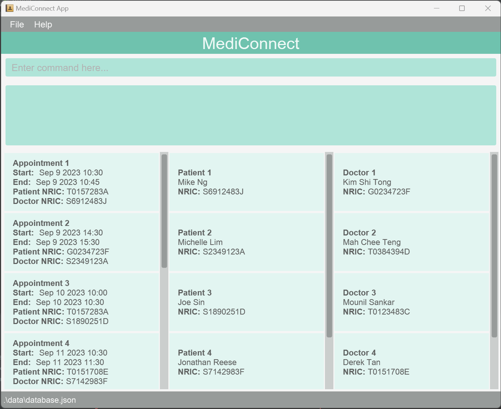

# MediConnect

Welcome to the User Guide of MediConnect!

## What is MediConnect?

MediConnect is a clinic management system (CMS) application designed to aid receptionist in a clinic om their day-to-day task.
These may include scheduling an appointment, retrieving a patient's medical history and updating the patient's medical record.

## Who is MediConnect for?

MediConnect is built for clinic receptionists and aims to help them to be more efficient and effective at accomplishing their administrative tasks.

## How can you get started?

If you are new to this guide, click [here](#introduction-to-this-user-guide) for a quick introduction to this user guide.

If you are keen to get started on using MediConnect, click [here](#quick-start) for our quick start guide.

--------------------------------------------------------------------------------------------------------------------

# Table of Contents

* TOC
{:toc}

--------------------------------------------------------------------------------------------------------------------

# Introduction to this user guide

This guide is designed for users of all level to master their use of MediConnect.

## Icons used in this guide

Here are some common icons that is used throughout this user guide

| Icons                          | Representation                                    |
|--------------------------------|---------------------------------------------------|
| :information_source:  **Note** | Provides you with additional useful information   |
| :exclamation: **Caution**      | Warns you on the common mistakes                  |
| :bulb: **Tip**                 | Provides you with tips to enhance your experience |


## Terms used in this guide

Here are some common terms that is used throughout this user guide

| Icons       | Representation                                                                 |
|-------------|--------------------------------------------------------------------------------|
| Command     | The instruction you enter into the application                                 |
| Parameter   | The additional information you provide for the instruction you intend to enter |
| Appointment | A scheduled medical consultation between the patient and the doctor            |

## Navigating this user guide

As this guide aims to be as comprehensive as possible, you might find the amount of information in this user guide to be overwhelming.
Fred not, you utilise the [Table of Content](#table-of-contents) to find the information your are looking for.

If you are new to MediConnect, you can head over to our [quick start](#quick-start) to learn the basics of this application.

If you are experienced with MediConnect, you can head over to view the list of [features](#features) or view the [command summary](#command-summary) to horne your MediConnect sklls.

return back to [Table of Contents](#table-of-contents)

--------------------------------------------------------------------------------------------------------------------

# Quick start

## Installing MediConnect

1. Ensure you have Java `11` or above installed in your Computer.

1. Download the latest `mediconnect.jar` from [here](https://github.com/AY2324S1-CS2103T-T08-1/tp/releases).

1. Copy the file to the folder you want to use as the _home folder_ for your MediConnect.

1. Open a command terminal, `cd` into the folder you put the jar file in, and use the `java -jar mediconnect.jar` command to run the application.<br>
   A GUI similar to the below should appear in a few seconds. Note how the app contains some sample data.<br>
   

1. Type the command in the command box and press Enter to execute it. e.g. typing **`help`** and pressing Enter will open the help window.<br>
   Some example commands you can try:

   * `list_a` : Lists all appointments.

   * `add_p n\Joe Ng ic\T0383462A p\83745623` : Adds a patient named `Joe Ng` to the list of Patient.

   * `delete_d 5` : Deletes the 5th doctor in the list of doctors.

   * `exit` : Exits the app.

1. Refer to the [Features](#features) below for details of each command.


## Navigating the application


The main window can be broken down into the following components:

- **Command Box**: The command box is where you will enter your input your commands
- **Result Display Box**: The box will display the output messages based on your entered commands
- **Appointment List Panel**: This panel will display the list of appointments sorted by their starting date and time
- **Patient List Panel**: This panel will display the list of patient sorted by their names
- **Doctor List Panel**: This panel will display the list of doctor sorted by their names

Back to [Table of Contents](#table-of-contents).

--------------------------------------------------------------------------------------------------------------------

# Features

The features are broken down to into:
- [General Features](#general-features)
- [Patient Management Features](#patient-management-features)
- [Doctor Management Features](#doctor-management-features)
- [Appointment Management Features](#appointment-management-features)

<div markdown="block" class="alert alert-info">

**:information_source: Notes about the command format:**<br>

* Words in `UPPER_CASE` are the parameters to be supplied by the user.<br>
  e.g. in `add n\NAME`, `NAME` is a parameter which can be used as `add n\John Doe`.

* Items in square brackets are optional.<br>
  e.g `n\NAME [t\TAG]` can be used as `n\John Doe t\friend` or as `n\John Doe`.

* Items with `…`​ after them can be used multiple times including zero times.<br>
  e.g. `[t\TAG]…​` can be used as ` ` (i.e. 0 times), `t\friend`, `t\friend t\family` etc.

* Parameters can be in any order.<br>
  e.g. if the command specifies `n\NAME p\PHONE_NUMBER`, `p\PHONE_NUMBER n\NAME` is also acceptable.

* Extraneous parameters for commands that do not take in parameters (such as `help`, `list`, `exit` and `clear`) will be ignored.<br>
  e.g. if the command specifies `help 123`, it will be interpreted as `help`.

* If you are using a PDF version of this document, be careful when copying and pasting commands that span multiple lines as space characters surrounding line-breaks may be omitted when copied over to the application.
</div>

## Patient Management Features

These are a list of features that help you manage the records of patient:
- [Adding patient](#adding-a-patient--addp)
- [Listing patient](#listing-all-patient--listp)
- [Viewing patient](#viewing-a-patient--viewp)
- [Editing patient](#editing-a-patient--editp)
- [Finding patient](#locating-patients-by-name--findp)
- [Deleting patient](#deleting-a-patient--deletep)

Back to [Table of Contents](#table-of-contents).

### Adding a patient: `add_p`

Adds a patient to the system.

Format: `add_p n\NAME ic\NRIC p\PHONE_NUMBER`

Examples:
* `add_p n\John Doe ic\T0212385J p\98765432`
* `add_p ic\S9912343G n\Betsy Crowe p\81235833`

Sample Usage:
1. Assuming you want to add a Patient named "Jonathan Reese" with NRIC "S8712461K" and phone number "81573238". 

2. Enter the following command:
```
add_p n\Jonathan Reese n\S8712461K p\81235833
```

3. The result box will display the following message:
```
"New patient added: Jonathan Reese NRIC: S8712461K Phone: 81235833"
```

4. You have successfully added the patient into the database.

Back to [Patient Management Features](#patient-management-features).

### Listing all patient : `list_p`

Shows a list of all patients in the system.

Format: `list_p`

Back to [Patient Management Features](#patient-management-features).

### Viewing a patient : `view_p`

Views the specified patient from the system.

Format: `view_p INDEX`

* Displays the full detail of the patient at the specified `INDEX`.
* The index refers to the index number shown in the displayed patient list.
* The index **must be a positive integer** 1, 2, 3, …​

Examples:
* `list_p` followed by `view_p 2` views the 2nd patient in the patient list.
* `find_p Jonathan` followed by `view_p 1` views the 1st patient in the results of the `find_p` command.

Back to [Patient Management Features](#patient-management-features).

### Editing a patient : `edit_p`

Edits an existing patient in the system.

Format: `edit_p INDEX [n\NAME] [ic\NRIC] [p\PHONE]`

* Edits the patient at the specified `INDEX`. The index refers to the index number shown in the displayed patient list. The index **must be a positive integer** 1, 2, 3, …​
* At least one of the optional fields must be provided.
* Existing values will be updated to the input values.

Examples:
*  `edit_p 1 n\Joe Ng` Edits the name of 1st patient to be `Joe Ng`.
*  `edit_p 2 p\91234567` Edits the phone of the 2nd patient to be `91234567`.

Sample Usage:
1. Assuming you want to edit the 4th Patient changing his phone from "81235833" to "81453894".

2. Enter the following command:
```
edit_p 4 p\81453894
```

3. The result box will display the following message:
```
"Edited Patient: Jonathan Reese NRIC: S8712461K Phone: 81453894"
```

4. You have successfully edited the patient into the database.

Back to [Patient Management Features](#patient-management-features).

### Locating patients by name: `find_p`

Finds patients whose names contain any of the given keywords.

Format: `find_p KEYWORD [MORE_KEYWORDS]`

* The search is case-insensitive. e.g `hans` will match `Hans`
* The order of the keywords does not matter. e.g. `Hans Bo` will match `Bo Hans`
* Only the name of the patient is searched.
* Only full words will be matched e.g. `Han` will not match `Hans`
* Patients matching at least one keyword will be returned (i.e. `OR` search).
  e.g. `Hans Bo` will return `Hans Gruber`, `Bo Yang`

Examples:
* `find_p John` returns `john` and `John Doe`
* `find_p alex david` returns `Alex Yeoh`, `David Li`<br>

Back to [Patient Management Features](#patient-management-features).

### Deleting a patient : `delete_p`

Deletes the specified patient from the system.

Format: `delete_p INDEX`

* Deletes the patient at the specified `INDEX`.
* The index refers to the index number shown in the displayed patient list.
* The index **must be a positive integer** 1, 2, 3, …​

Examples:
* `list_p` followed by `delete_p 2` deletes the 2nd patient in the patient list.
* `find_p Jonathan` followed by `delete_p 1` deletes the 1st patient in the results of the `find_p` command.

Back to [Patient Management Features](#patient-management-features).

## Doctor Management Features

These are a list of features that help you manage the records of doctor:
- [Adding doctor](#adding-a-doctor--addd)
- [Listing doctor](#listing-all-doctor--listd)
- [Viewing doctor](#viewing-a-doctor--viewd)
- [Editing doctor](#editing-a-doctor--editd)
- [Finding doctor](#locating-doctors-by-name--findd)
- [Deleting doctor](#deleting-a-doctor--deleted)
- [Adding Specialisation](#adding-a-specialisation--addtagd)
- [Deleting Specialisation](#deleting-a-specialisation--deletetagd)
- [Editing Remark](#editing-a-remark--remarkd)

Back to [Table of Contents](#table-of-contents).

### Adding a doctor: `add_d`

Adds a doctor to the system.

Format: `add_d n\NAME ic\NRIC`

Examples:
* `add_d n\John Doe ic\T0212385J`
* `add_d ic\S9912343G n\Betsy Crowe`

Sample Usage:
1. Assuming you want to add a Doctor named "John Doe" with NRIC "T0212385J".

2. Enter the following command:
```
add_d n\John Doe ic\T0212385J
```

3. The result box will display the following message:
```
"New doctor added: John Doe Nric: T0212385J"
```

4. You have successfully added the doctor into the database.

Back to [Doctor Management Features](#doctor-management-features).

### Listing all doctor : `list_d`

Shows a list of all doctors in the system.

Format: `list_d`

Back to [Doctor Management Features](#doctor-management-features).

### Viewing a doctor : `view_d`

Views the specified doctor from the system.

Format: `view_d INDEX`

* Displays the full detail of the doctor at the specified `INDEX`.
* The index refers to the index number shown in the displayed doctor list.
* The index **must be a positive integer** 1, 2, 3, …​

Examples:
* `list_d` followed by `view_d 2` views the 2nd doctor in the doctor list.
* `find_d Jonathan` followed by `view_d 1` views the 1st doctor in the results of the `find_d` command.

Back to [Doctor Management Features](#doctor-management-features).

### Editing a doctor : `edit_d`

Edits an existing doctor in the system.

Format: `edit_d INDEX [ic\NRIC] [n\NAME]`

* Edits the doctor at the specified `INDEX`. The index refers to the index number shown in the displayed doctor list. The index **must be a positive integer** 1, 2, 3, …​
* At least one of the optional fields must be provided.
* Existing values will be updated to the input values.

Examples:
*  `edit_d 1 n\Joe Ng ic\T0212385J` Edits the name and NRIC of the 1st doctor to be `Joe Ng` and `T0212385J` respectively.

Sample Usage:
1. Assuming you want to edit the 4th doctor changing his NRIC from "T0212384J" to "T0212385J".

2. Enter the following command:
```
edit_d 4 ic\T0212385J
```

3. The result box will display the following message:
```
"Edited Doctor: Joe Ng Nric: T0212385J"
```

4. You have successfully edited the patient into the database.

Back to [Doctor Management Features](#doctor-management-features).

### Locating doctors by name: `find_d`

Finds doctor whose names contain any of the given keywords.

Format: `find_d KEYWORD [MORE_KEYWORDS]`

* The search is case-insensitive. e.g `hans` will match `Hans`
* The order of the keywords does not matter. e.g. `Hans Bo` will match `Bo Hans`
* Only the name of the doctor is searched.
* Only full words will be matched e.g. `Han` will not match `Hans`
* Doctors matching at least one keyword will be returned (i.e. `OR` search).
  e.g. `Hans Bo` will return `Hans Gruber`, `Bo Yang`

Examples:
* `find_d John` returns `john` and `John Doe`
* `find_d alex david` returns `Alex Yeoh`, `David Li`<br>

Back to [Doctor Management Features](#doctor-management-features).

### Deleting a doctor : `delete_d`

Deletes the specified doctor from the system.

Format: `delete_d INDEX`

* Deletes the doctor at the specified `INDEX`.
* The index refers to the index number shown in the displayed doctor list.
* The index **must be a positive integer** 1, 2, 3, …​

Examples:
* `list_d` followed by `delete 2` deletes the 2nd doctor in the doctor list.
* `find_d Jonathan` followed by `delete 1` deletes the 1st doctor in the results of the `find_d` command.

### Adding a specialisation : `add_tag_d`

Adds the specified specialisation from a doctor from the system.

Format: `add_tag_d INDEX [t\SPECIALISATION]`

* Adds the specialisation of doctor at the specified `INDEX`.
* The index refers to the index number shown in the displayed doctor list.
* The index **must be a positive integer** 1, 2, 3, …

Examples:
* `list_d` followed by `add_tag_d 2 Orthopaedic` add specialisation the 2nd doctor in the doctor list.
* `find_d Jonathan` followed by `add_tag_d 1 Orthopaedic` add specialisation the 1st doctor in the results of the `find_d` command.

### Deleting a specialisation : `delete_tag_d`

Deletes the specified specialisation from a doctor from the system.

Format: `delete_tag_d INDEX [t\SPECIALISATION]`

* Adds the specialisation of doctor at the specified `INDEX`.
* The index refers to the index number shown in the displayed doctor list.
* The index **must be a positive integer** 1, 2, 3, …

Examples:
* `list_d` followed by `delete_tag_d 2 Orthopaedic` add specialisation the 2nd doctor in the doctor list.
* `find_d Jonathan` followed by `delete_tag_d 1 Orthopaedic` add specialisation the 1st doctor in the results of the `find_d` command.

### Editing a remark : `remark_d`

Edits the remark of a doctor from the system.

Format: `remark_d INDEX [r\REMARK]`

* Edits the remark of doctor at the specified `INDEX`.
* The index refers to the index number shown in the displayed doctor list.
* The index **must be a positive integer** 1, 2, 3, …

Examples:
* `list_d` followed by `remark_d 2 Doctor will not be in clinic until 30/12/2023` add specialisation the 2nd doctor in the doctor list.
* `find_d Jonathan` followed by `remark_d 1 Doctor will not be in clinic until 30/12/2023` add specialisation the 1st doctor in the results of the `find_d` command.

Back to [Doctor Management Features](#doctor-management-features).

## Appointment Management Features

These are a list of features that help you manage the records of appointment:
- [Adding appointment](#adding-an-appointment--adda)
- [Listing appointment](#listing-all-appointments-or-by-patient-or-doctor-nric--lista)
- [Viewing appointment](#viewing-an-appointment--viewa)
- [Editing appointment](#editing-a-appointment--edita)
- [Deleting appointment](#deleting-an-appointment--deletea)

Back to [Table of Contents](#table-of-contents).

### Adding an appointment: `add_a`

Adds an appointment into the system.

Format: `add_a pic\PATIENT_NRIC dic\DOCTOR_NRIC from\START_TIME to\END_TIME`

Examples:
* `add_a pic\S9912343G dic\T0212385J from\2023-09-11 07:30 to\2023-09-11 08:00 `

Back to [Appointment Management Features](#appointment-management-features).

### Listing all appointments, or by patient or doctor NRIC: `list_a`

Shows a list of appointments in the system depending on the fields given.

Format: `list_a [pic\PATIENT_NRIC] [dic\DOCTOR_NRIC]`

* Find any appointment of the doctor or patient with the specified `NRIC`.
* List all the appointments in the system if no fields are given.

Examples:
* `list_a pic\S9912343G` returns all the appointment the patient with NRIC `S9912343G` has.

Back to [Appointment Management Features](#appointment-management-features).

### Viewing an appointment: `view_a`

Views the specified appointment from the system.

Format: `view_a INDEX`

* Displays the full detail of the appointment at the specified `INDEX`.
* The index refers to the index number shown in the displayed appointment list.
* The index **must be a positive integer** 1, 2, 3, …​

Examples:
* `list_a` followed by `view_a 2` views the 2nd appointment in the appointment list.

Back to [Appointment Management Features](#appointment-management-features).

### Deleting an appointment : `delete_a`

Deletes the specified appointment from the system.

Format: `delete_a INDEX`

* Deletes the appointment with the specified `INDEX`.

Examples:
* `delete_a 2` deletes the 2nd appointment in the appointment list.

Back to [Appointment Management Features](#appointment-management-features).

## General Features

These are the list of general features built into MediConnect:
- [Help](#viewing-help--help)
- [Exit](#exiting-the-program--exit)
- [Saving the data](#saving-the-data)
- [Editing the data](#editing-the-data-file)

Back to [Table of Contents](#table-of-contents).

### Viewing help : `help`

Shows a message explaining how to access the help page.


Format: `help`

Back to [General Features](#general-features).

### Exiting the program : `exit`

Exits the program.

Format: `exit`

Back to [General Features](#general-features).

### Saving the data

MediConnect data are saved in the hard disk automatically after any command that changes the data. There is no need to save manually.

Back to [General Features](#general-features).

### Editing the data file

MediConnect data are saved automatically as a JSON file `[JAR file location]/data/database.json`. Advanced users are welcome to update data directly by editing that data file.

<div markdown="span" class="alert alert-warning">:exclamation: **Caution:**
If your changes to the data file makes its format invalid, MediConnect will discard all data and start with an empty data file at the next run. Hence, it is recommended to take a backup of the file before editing it.
</div>

Back to [General Features](#general-features).

--------------------------------------------------------------------------------------------------------------------

# FAQ

**Q**: How do I transfer my data to another Computer?<br>
**A**: Install the app in the other computer and overwrite the empty data file it creates with the file that contains the data of your previous MediConnect home folder.

Back to [Table of Contents](#table-of-contents).

--------------------------------------------------------------------------------------------------------------------

# Known issues

1. _Details coming soon ..._

Back to [Table of Contents](#table-of-contents).

--------------------------------------------------------------------------------------------------------------------

# Command summary

| Action                    | Format, Examples                                                                                                                                              |
|---------------------------|---------------------------------------------------------------------------------------------------------------------------------------------------------------|
| **Add Patient**           | `add_p n\NAME ic\NRIC p\PHONE_NUMBER` <br> e.g., `add_p n\John Doe ic\T0212385J p\98765432`                                                                   |
| **Add Doctor**            | `add_d n\NAME ic\NRIC` <br> e.g., `add_d n\John Doe ic\T0212385J`                                                                                             |
| **Add Appointment**       | `add_a pic\PATIENT_NRIC dic\DOCTOR_NRIC from\START_TIME to\END_TIME` <br> e.g., `add_a pic\S9912343G dic\T0212385J from\2023-09-11 07:30 to\2023-09-11 08:30` |
| **Delete Patient**        | `delete_p INDEX`<br> e.g., `delete_p 1`                                                                                                                       |
| **Delete Doctor**         | `delete_d INDEX`<br> e.g., `delete_d 2`                                                                                                                       |
| **Delete Appointment**    | `delete_a INDEX`<br> e.g., `delete_a 3`                                                                                                                       |
| **View Patient**          | `view_p INDEX`<br> e.g., `view_p 1`                                                                                                                           |
| **View Doctor**           | `view_d INDEX`<br> e.g., `view_d 2`                                                                                                                           |
| **View Appointment**      | `view_a INDEX`<br> e.g., `view_a 3`                                                                                                                           |
| **Edit Patient**          | `edit_p INDEX [ic\NRIC] [n\NAME] [p\PHONE]`<br> e.g.,`edit_p 3 ic\T0212385J n\Joe Ng`                                                                         |
| **Edit Doctor**           | `edit_d INDEX [ic\NRIC] [n\NAME]`<br> e.g.,`edit_d 2 ic\T0212385J n\Joe Ng`                                                                                   |
| **Find Patient**          | `find_p KEYWORD [MORE_KEYWORDS]`<br> e.g., `find_p James Jake`                                                                                                |
| **Find Patient**          | `find_d KEYWORD [MORE_KEYWORDS]`<br> e.g., `find_d James Jake`                                                                                                |
| **List Patient**          | `list_p`                                                                                                                                                      |
| **List Doctor**           | `list_d`                                                                                                                                                      |
| **List Appointment**      | `list_a`                                                                                                                                                       |
| **Add Specialisation**    | `add_tag_d INDEX [t\SPECIALISATION]` <br> e.g., `add_tag_d 1 Orthopaedic`                                                                                     |
| **Delete Specialisation** | `delete_tag_d INDEX [t\SPECIALISATION]` <br> e.g., `delete_tag_d 1 Orthopaedic`                                                                               |
| **Edit Doctor Remark**    | `remark_d INDEX [r\REMARK]` <br> e.g., `remark_d 1 Doctor will not be in clinic until 30/12/2023`                                                             |
| **Help**                  | `help`                                                                                                                                                        |

Back to [Table of Contents](#table-of-contents).
