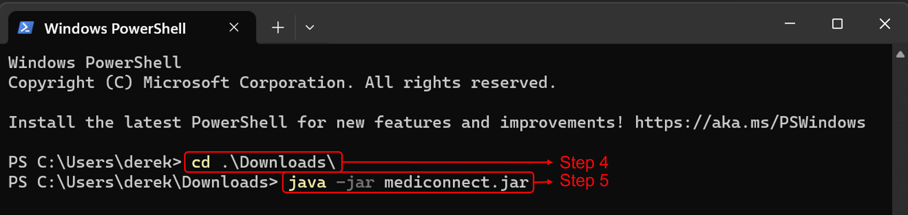

Welcome to the user guide of MediConnect!

MediConnect is a clinic management system (CMS) application designed for clinic receptionists. It aims to help them to be more efficient and effective at accomplishing their administrative tasks.

These administrative tasks can include:
- Scheduling an appointment
- Retrieving a patient's medical history
- Checking a doctor's availability
- Updating a patient's medical record

If you are new to this guide, click [here](#introduction-to-this-user-guide) for a quick introduction to this user guide.

If you are keen to get started on using MediConnect, click [here](#quick-start) for our quick start guide.

--------------------------------------------------------------------------------------------------------------------

# Table of Contents

* TOC
{:toc}

--------------------------------------------------------------------------------------------------------------------

# Introduction to this user guide

This guide is designed for users of all level to master their use of MediConnect.

## Icons used in this guide

Here are some common icons that are used throughout this user guide

| Icons                          | Representation                                    |
|--------------------------------|---------------------------------------------------|
| :information_source:  **Note** | Provides you with additional useful information   |
| :exclamation: **Caution**      | Warns you on the common mistakes                  |
| :bulb: **Tip**                 | Provides you with tips to enhance your experience |


## Terms used in this guide

Here are some common terms that are used throughout this user guide

| Icons       | Representation                                                                 |
|-------------|--------------------------------------------------------------------------------|
| Command     | The instruction you enter into the application                                 |
| Parameter   | The additional information you provide for the instruction you intend to enter |
| Appointment | A scheduled medical consultation between the patient and the doctor            |

## Navigating this user guide

As this guide aims to be as comprehensive as possible, you might find the amount of information in this user guide to be overwhelming.
Fret not, you can utilise the [Table of Content](#table-of-contents) to find the information you are looking for.

If you are new to MediConnect, you can head over to our [quick start](#quick-start) to learn the basics of this application.

If you are experienced with MediConnect, you can head over to view the list of [features](#features) or view the [command summary](#command-summary) to hone your MediConnect skills.

return back to [Table of Contents](#table-of-contents)

--------------------------------------------------------------------------------------------------------------------

# Quick start

## Installing MediConnect

1. Ensure you have Java `11` or above installed in your Computer. If you already have it installed, follow this [guide](https://blog.hubspot.com/website/check-java-verison) to check your Java version.

    If you do not have it installed yet or your Java version is below `11`, refer to the following guides based on your operating system:

    - [Windows](https://docs.oracle.com/en/java/javase/11/install/installation-jdk-microsoft-windows-platforms.html#GUID-371F38CC-248F-49EC-BB9C-C37FC89E52A0)

    - [macOS](https://docs.oracle.com/en/java/javase/11/install/installation-jdk-macos.html#GUID-F575EB4A-70D3-4AB4-A20E-DBE95171AB5F)

    - [Linux](https://docs.oracle.com/en/java/javase/11/install/installation-jdk-linux-platforms.html#GUID-4A6BD592-1840-4BB4-A758-4CD49E9EE88B)

2. Download the latest `mediconnect.jar` from [here](https://github.com/AY2324S1-CS2103T-T08-1/tp/releases).

3. Copy the file to the folder you want to use as the _home folder_ for your MediConnect.

4. Open a command terminal, `cd` into the folder you put the jar file in

5. Use the `java -jar mediconnect.jar` command to run the application.<br>
    
    The commands you give should look similar to what is shown below:
   

    A GUI similar to the below should appear in a few seconds. Note how the app contains some sample data.<br>
   

6. Type the command in the command box and press Enter to execute it. e.g. typing **`help`** and pressing Enter will open the help window.<br>
   Some example commands you can try:

   * `list_a` : Lists all appointments.

   * `add_p n\Joe Ng ic\T0383462A p\83745623` : Adds a patient named `Joe Ng` to the list of Patient.

   * `delete_d 5` : Deletes the 5th doctor in the list of doctors.

   * `exit` : Exits the app.

7. Refer to the [Features](#features) below for details of each command.

Back to [Table of Contents](#table-of-contents).

## Navigating the application


The main window can be broken down into the following components:

- **Command Box**: The command box is where you will enter your input your commands
- **Result Display Box**: This box will display the output messages in response to your commands
- **Appointment List Panel**: This panel will display the list of filtered appointments
- **Patient List Panel**: This panel will display the list of filtered patients
- **Doctor List Panel**: This panel will display the list of filtered doctors

Back to [Table of Contents](#table-of-contents).

--------------------------------------------------------------------------------------------------------------------

# Features

The features are broken down to into:
- [Patient Management Features](#patient-management-features)
- [Doctor Management Features](#doctor-management-features)
- [Appointment Management Features](#appointment-management-features)
- [General Features](#general-features)

<div markdown="block" class="alert alert-primary">

**:information_source: Notes about the command format:**<br>

* Words in `UPPER_CASE` are the parameters you would need to provide.<br>
  e.g. in `add n\NAME`, `NAME` is a parameter which can be used as `add n\John Doe`.

* Parameters in square brackets are optional.<br>
  e.g. for `INDEX [dic\DOCTOR_NRIC] [pic\PATIENT_NRIC]`, both `DOCTOR_NRIC` and `PATIENT_NRIC` are optional. Valid inputs include `3 dic\T1023470J pic\S1875409K`, `3 pic\S1875409K` or even `3`.

* Parameters can be entered in any order.<br>
  e.g. if the command specifies `n\NAME p\PHONE_NUMBER`, `p\PHONE_NUMBER n\NAME` is also acceptable.

* Extraneous parameters for commands that do not take in parameters (such as `help`, `list_p` and `exit`) will be ignored.<br>
  e.g. if the command specifies `help 123`, it will be interpreted as `help`.

* If you are using a PDF version of this document, be careful when copying and pasting commands that span multiple lines as space characters surrounding line-breaks may be omitted when copied over to the application.
</div>

## Parameters used in this guide

The following table gives an overview of what each parameter used in the Features section is for.

| Parameter         | Description                                                          | Valid Parameter Input                                                              |
|-------------------|----------------------------------------------------------------------|------------------------------------------------------------------------------------|
| NAME              | The full name of the doctor/patient                                  | Only accepts alphanumeric characters and spaces                                    |
| NRIC              | The National Registration Identity Card number of the doctor/patient | Starts with S/T/F/G/M and followed by 7 digits and ends with an uppercase alphabet |
| PHONE_NUMBER      | The phone number of the doctor/patient                               | Only contain numbers, and it should be at least 3 digits long.                     |
| INDEX             | The position of the appointment/doctor/patient in the filtered list  | Must be a positive integer (1, 2, 3, ...)                                          |
| MEDICAL_CONDITION | The medical condition of the patient                                 | Only accepts alphanumeric characters without any spaces                            |
| SPECIALISATION    | The specialisation of the doctor                                     | Only accepts alphanumeric characters without any spaces                            |
| PRESCRIPTION      | The prescription of the appointment                                  | Only accepts alphanumeric characters without any spaces                            |


<div markdown="span" class="alert alert-primary">:information_source: <b>Note:</b>
An "alphanumeric" character is a character that can be either a letter (A to Z, both uppercase and lowercase) or a number (0 to 9).
</div>

## Patient Management Features

This is the list of features that help you manage the records of patient:
- [Adding patient](#adding-a-patient-add_p)
- [Listing patient](#listing-all-patient--list_p)
- [Viewing patient](#viewing-a-patient--view_p)
- [Editing patient](#editing-a-patient--edit_p)
- [Finding patient](#locating-patients-by-name--find_p)
- [Deleting patient](#deleting-a-patient--delete_p)
- [Adding a medical condition to a patient](#adding-a-medical-condition-to-a-patient--add_tag_p)
- [Deleting a medical condition of a patient](#deleting-a-medical-condition-from-a-patient--delete_tag_p)
- [Editing the remark of a patient](#editing-the-remark-of-a-patient--remark_p)


Back to [Table of Contents](#table-of-contents).

### Adding a patient: `add_p`

Allows you to add a patient into the system.

**Format**: `add_p n\NAME ic\NRIC p\PHONE_NUMBER`

**Examples**:
* `add_p n\John Doe ic\T0212385J p\98765432`
* `add_p ic\S9912343G n\Betsy Crowe p\81235833`

**Sample Usage**:
1. Assuming you want to add a Patient named "Jonathan Reese" with NRIC "S8712461K" and phone number "81573238". 

2. Enter the following command:
```
add_p n\Jonathan Reese n\S8712461K p\81235833
```

3. The result box will display the following message:
```
"New patient added: Jonathan Reese NRIC: S8712461K Phone: 81235833"
```

4. You have successfully added the patient into the database.

Back to [Patient Management Features](#patient-management-features).

<div markdown="span" class="alert alert-info">:bulb: <b>Tip:</b>
Double check the phone number before pressing enter! Extremely long phone numbers may not be displayed fully in the Patient window.
</div>

### Listing all patient : `list_p`

Allows you to list all patients in the system.

**Format**: `list_p`

Back to [Patient Management Features](#patient-management-features).

### Viewing a patient : `view_p`

Allows you to view details, such as basic information, medical condition and remark, of a specific patient in the system.

**Format**: `view_p INDEX`

* Displays the full detail of the patient at the specified `INDEX`.
* The index refers to the index number shown in the displayed patient list.
* The index **must be a positive integer** 1, 2, 3, …​

**Examples**:
* Entering `list_p` followed by `view_p 2` views the 2nd patient in the patient list.
* Entering `find_p Jonathan` followed by `view_p 1` views the 1st patient in the results of the `find_p` command.

Below is an example of a successful view command call.


Back to [Patient Management Features](#patient-management-features).

### Editing a patient : `edit_p`

Allows you to edit an existing patient in the system. This is useful to correct any mistakes made when adding or updating a patient.

**Format**: `edit_p INDEX [n\NAME] [ic\NRIC] [p\PHONE]`

* Edits the patient at the specified `INDEX`. The index refers to the index number shown in the displayed patient list. The index **must be a positive integer** 1, 2, 3, …​
* At least one of the optional fields must be provided.
* Existing values will be updated to the input values.

**Examples**:
*  `edit_p 1 n\Joe Ng` edits the name of 1st patient to be `Joe Ng`.
*  `edit_p 2 p\91234567` edits the phone of the 2nd patient to be `91234567`.

**Sample Usage**:
1. Assuming you want to edit the 4th Patient changing his phone from "81235833" to "81453894".

2. Enter the following command:
```
edit_p 4 p\81453894
```

3. The result box will display the following message:
```
"Edited Patient: Jonathan Reese NRIC: S8712461K Phone: 81453894"
```

4. You have successfully edited the patient into the database.

<div markdown="span" class="alert alert-primary">
:information_source: <b>Note:</b> Note that all appointments containing the patient's old NRIC will be updated to the new NRIC.<br>
</div>

Back to [Patient Management Features](#patient-management-features).

### Locating patients by name : `find_p`

Allows you to find patients whose name contains any of the given keywords.

**Format**: `find_p KEYWORD [MORE_KEYWORDS]`

* The search is case-insensitive. e.g. `hans` will match `Hans`
* The order of the keywords does not matter. e.g. `Hans Bo` will match `Bo Hans`
* Only the name of the patient is searched.
* Only full words will be matched e.g. `Han` will not match `Hans`
* Patients matching at least one keyword will be returned (i.e. `OR` search).
  e.g. `Hans Bo` will return `Hans Gruber`, `Bo Yang`

**Examples**:
* `find_p John` returns `john` and `John Doe`
* `find_p alex david` returns `Alex Yeoh`, `David Li`<br>

Back to [Patient Management Features](#patient-management-features).

### Deleting a patient : `delete_p`

Allows you to delete a specified patient from the system.

**Format**: `delete_p INDEX`

* Deletes the patient at the specified `INDEX`.
* The index refers to the index number shown in the displayed patient list.
* The index **must be a positive integer** 1, 2, 3, …​

**Examples**:
* Entering `list_p` followed by `delete_p 2` deletes the 2nd patient in the patient list.
* Entering `find_p Jonathan` followed by `delete_p 1` deletes the 1st patient in the results of the `find_p` command.

<div markdown="span" class="alert alert-warning">:exclamation: <b>Caution:</b>
If patient is deleted, the patient's appointments will also be deleted.
</div>


Back to [Patient Management Features](#patient-management-features).

### Adding a medical condition to a patient : `add_tag_p`

Allow you to add a medical condition to a specified patient in the system.

**Format**: `add_tag_p INDEX t\MEDICAL_CONDITION`

* Adds the given medical condition to the patient at the specified `INDEX`.
* The index refers to the index number shown in the displayed patient list.
* The index **must be a positive integer** 1, 2, 3, …​
* Only one medical condition can be added at a time.

**Examples**:
* Entering `list_p` followed by `add_tag_p 2 t\diabetes` adds the medical condition `diabetes` to the 2nd patient in the patient list.
* Entering `find_p Jonathan` followed by `add_tag_p 1 t\cancer` adds the medical condition `cancer` to the 1st patient in the results of the `find_p` command.

Back to [Patient Management Features](#patient-management-features).

### Deleting a medical condition from a patient : `delete_tag_p`

Allows you to delete a medical condition from a specified patient in the system.

**Format**: `delete_tag_p INDEX t\MEDICAL_CONDITION`

* Deletes the input medical condition to the patient at the specified `INDEX`.
* The index refers to the index number shown in the displayed patient list.
* The index **must be a positive integer** 1, 2, 3, …​
* The given `MEDICAL_CONDITION` must be a present medical condition of the specified patient.
* Only one medical condition can be deleted at a time.

**Examples**:
* Entering `list_p` followed by `delete_tag_p 2 t\diabetes` deletes the medical condition `diabetes` of the 2nd patient in the patient list.
* Entering `find_p Jonathan` followed by `delete_tag_p 1 t\cancer` deletes the medical condition `cancer` of the 1st patient in the results of the `find_p` command.

Back to [Patient Management Features](#patient-management-features).

### Editing the remark of a patient : `remark_p`

Allows you to edit the remark of a specified patient in the system. The patient's remark can be used to store temporary information such as family health history and current medications/treatments patients are on.

**Format**: `remark_p INDEX r\REMARK`

* Adds the input `REMARK` to the patient at the specified `INDEX`.
* The index refers to the index number shown in the displayed patient list.
* The index **must be a positive integer** 1, 2, 3, …​
* The remark will be updated with the input `REMARK`.
* An empty `REMARK` input will delete the previously stored remark.


**Examples**:
* Entering `list_p` followed by `remark_p 2 r\need follow up` adds the remark `need follow up` to the 2nd patient in the patient list.
* Entering `find_p Jonathan` followed by `remark_p 1 r\new patient` adds the remark `new patient` to the 1st patient in the results of the `find_p` command.

<div markdown="span" class="alert alert-info">:bulb: <b>Tip:</b>
Keep your remarks concise as extremely long remarks might not be fully displayed in the Patient Window
</div>

Back to [Patient Management Features](#patient-management-features).

## Doctor Management Features

This is the list of features that help you manage the records of doctor:
- [Adding doctor](#adding-a-doctor--add_d)
- [Listing doctor](#listing-all-doctor--list_d)
- [Viewing doctor](#viewing-a-doctor--view_d)
- [Editing doctor](#editing-a-doctor--edit_d)
- [Finding doctor](#locating-doctors-by-name--find_d)
- [Deleting doctor](#deleting-a-doctor--delete_d)
- [Adding a Specialisation to a doctor](#adding-a-specialisation-to-a-doctor--add_tag_d)
- [Deleting a Specialisation from a doctor](#deleting-a-specialisation-from-a-doctor--delete_tag_d)
- [Editing the Remark of a doctor](#editing-the-remark-of-a-doctor--remark_d)

Back to [Table of Contents](#table-of-contents).

### Adding a doctor : `add_d`

Allows you to add a doctor to the system.

**Format**: `add_d n\NAME ic\NRIC`

**Examples**:
* `add_d n\John Doe ic\T0212385J`
* `add_d ic\S9912343G n\Betsy Crowe`

**Sample Usage**:
1. Assuming you want to add a doctor named "John Doe" with NRIC "T0212385J".

2. Enter the following command:
```
add_d n\John Doe ic\T0212385J
```

3. The result box will display the following message:
```
"New doctor added: John Doe Nric: T0212385J"
```

4. You have successfully added the doctor into the database.

Back to [Doctor Management Features](#doctor-management-features).

### Listing all doctor : `list_d`

Allows you to list all the doctors in the system.

**Format**: `list_d`

Back to [Doctor Management Features](#doctor-management-features).

### Viewing a doctor : `view_d`

Allows you to view details, such as basic information, specialisation and remark, of a specific doctor in the system.

**Format**: `view_d INDEX`

* Displays the full details of the doctor at the specified `INDEX`.
* The index refers to the index number shown in the displayed doctor list.
* The index **must be a positive integer** 1, 2, 3, …​

**Examples**:
* Entering `list_d` followed by `view_d 2` views the 2nd doctor in the doctor list.
* Entering `find_d Jonathan` followed by `view_d 1` views the 1st doctor in the results of the `find_d` command.

Below is the image of a successful result that you should have encountered.


Back to [Doctor Management Features](#doctor-management-features).

### Editing a doctor : `edit_d`

Allows you to edit an existing doctor in the system. This is useful to correct any mistakes made when adding or updating a doctor.

**Format**: `edit_d INDEX [ic\NRIC] [n\NAME]`

* Edits the doctor at the specified `INDEX`. The index refers to the index number shown in the displayed doctor list. The index **must be a positive integer** 1, 2, 3, …​
* At least one of the optional fields must be provided.
* Existing values will be updated to the input values.

**Examples**:
*  `edit_d 1 n\Joe Ng ic\T0212385J` edits the name and NRIC of the 1st doctor to be `Joe Ng` and `T0212385J` respectively.

**Sample Usage**:
1. Assuming you want to edit the 4th doctor changing his NRIC from "T0212384J" to "T0212385J".

2. Enter the following command:
```
edit_d 4 ic\T0212385J
```

3. The result box will display the following message:
```
"Edited Doctor: Joe Ng Nric: T0212385J"
```

4. You have successfully edited the doctor into the database.

<div markdown="span" class="alert alert-primary">
:information_source: <b>Note:</b> Note that all appointments containing the doctor's old NRIC will be updated to the new NRIC.<br>
</div>

Back to [Doctor Management Features](#doctor-management-features).

### Locating doctors by name : `find_d`

Allow you to locate doctors whose name contains any of the given keywords.

**Format**: `find_d KEYWORD [MORE_KEYWORDS]`

* The search is case-insensitive. e.g. `hans` will match `Hans`
* The order of the keywords does not matter. e.g. `Hans Bo` will match `Bo Hans`
* Only the name of the doctor is searched.
* Only full words will be matched e.g. `Han` will not match `Hans`
* Doctors matching at least one keyword will be returned (i.e. `OR` search).
  e.g. `Hans Bo` will return `Hans Gruber`, `Bo Yang`

**Examples**:
* `find_d John` returns `john` and `John Doe`
* `find_d alex david` returns `Alex Yeoh`, `David Li`<br>

Back to [Doctor Management Features](#doctor-management-features).

### Deleting a doctor : `delete_d`

Allows you to delete a specific doctor from the system.

**Format**: `delete_d INDEX`

* Deletes the doctor at the specified `INDEX`.
* The index refers to the index number shown in the displayed doctor list.
* The index **must be a positive integer** 1, 2, 3, …​

**Examples**:
* Entering `list_d` followed by `delete 2` deletes the 2nd doctor in the doctor list.
* Entering `find_d Jonathan` followed by `delete 1` deletes the 1st doctor in the results of the `find_d` command.

<div markdown="span" class="alert alert-warning">:exclamation: <b>Caution:</b>
If doctor is being removed, the appointments of the doctor's will also be deleted too!.
</div>

Back to [Doctor Management Features](#doctor-management-features).

### Adding a specialisation to a doctor : `add_tag_d`

Allows you to add a specialisation for a specified doctor in the system.

**Format**: `add_tag_d INDEX t\SPECIALISATION`

* Adds the specialisation of doctor at the specified `INDEX`.
* The index refers to the index number shown in the displayed doctor list.
* The index **must be a positive integer** 1, 2, 3, …
* Only one specialisation can be added at a time.

**Examples**:
* Entering `list_d` followed by `add_tag_d 2 t\Orthopaedic` add specialisation the 2nd doctor in the doctor list.
* Entering `find_d Jonathan` followed by `add_tag_d 1 t\Orthopaedic` add specialisation the 1st doctor in the results of the `find_d` command.

Back to [Doctor Management Features](#doctor-management-features).

### Deleting a specialisation from a doctor : `delete_tag_d`

Allows you to delete a specialisation from a specific doctor in the system.

**Format**: `delete_tag_d INDEX t\SPECIALISATION`

* Adds the specialisation of doctor at the specified `INDEX`.
* The index refers to the index number shown in the displayed doctor list.
* The index **must be a positive integer** 1, 2, 3, …
* The given `SPECIALISATION` must be a present specialisation of the specified doctor.
* Only one specialisation can be deleted at a time.

**Examples**:
* Entering `list_d` followed by `delete_tag_d 2 t\Orthopaedic` add specialisation the 2nd doctor in the doctor list.
* Entering `find_d Jonathan` followed by `delete_tag_d 1 t\Orthopaedic` add specialisation the 1st doctor in the results of the `find_d` command.

Back to [Doctor Management Features](#doctor-management-features).

### Editing the remark of a doctor : `remark_d`

Allows you to edit the remark of a specified doctor in the system. The doctor's remark is usually used to indicate the doctor's availability.

**Format**: `remark_d INDEX r\REMARK`

* Edits the remark of doctor at the specified `INDEX`.
* The index refers to the index number shown in the displayed doctor list.
* The index **must be a positive integer** 1, 2, 3, …

**Examples**:
* Entering `list_d` followed by `remark_d 2 r\Doctor will not be in clinic until 30/12/2023` add specialisation the 2nd doctor in the doctor list.
* Entering `find_d Jonathan` followed by `remark_d 1 r\Doctor will not be in clinic until 30/12/2023` add specialisation the 1st doctor in the results of the `find_d` command.

<div markdown="span" class="alert alert-info">:bulb: <b>Tip:</b>
Keep your remarks concise as extremely long remarks might not be fully displayed in the Doctor Window
</div>

Back to [Doctor Management Features](#doctor-management-features).

## Appointment Management Features

This is the list of features that help you manage the records of appointment:
- [Adding appointment](#adding-an-appointment--add_a)
- [Listing appointment](#listing-all-appointments-or-by-patient-or-doctor-nric--list_a)
- [Viewing appointment](#viewing-an-appointment--view_a)
- [Editing appointment](#editing-an-appointment--edit_a)
- [Deleting appointment](#deleting-an-appointment--delete_a)
- [Adding a prescription to an appointment](#adding-a-prescription-to-an-appointment--add_tag_a)
- [Deleting a prescription from an appointment](#deleting-a-prescription-from-an-appointment--delete_tag_a)
- [Editing the remark of an appointment](#editing-the-remark-of-an-appointment--remark_a)

Back to [Table of Contents](#table-of-contents).

### Adding an appointment : `add_a`

Allows you to add an appointment into the system.

**Format**: `add_a pic\PATIENT_NRIC dic\DOCTOR_NRIC from\START_TIME to\END_TIME`

**Examples**:
* `add_a pic\S9912343G dic\T0212385J from\2023-09-11 07:30 to\2023-09-11 08:00 `

Back to [Appointment Management Features](#appointment-management-features).

### Listing all appointments, or by patient or doctor NRIC : `list_a`

Allows you to either display all the appointments in the system, or the list of appointments a specified patient/doctor has in the system.

**Format**: `list_a [pic\PATIENT_NRIC] [dic\DOCTOR_NRIC]`

* Find any appointment of the doctor or patient with the specified `NRIC`.
* List all the appointments in the system if no fields are given.

**Examples**:
* `list_a pic\S9912343G` returns all the appointments that have the patient NRIC `S9912343G`.

Back to [Appointment Management Features](#appointment-management-features).

### Editing an appointment : `edit_a`

Allows you to edit an existing appointment in the system. This is useful to correct any mistakes made when adding or updating an appointment.

**Format**: `edit_a INDEX [pic\PATIENT_NRIC] [dic\DOCTOR_NRIC] [from\START_TIME] [to\END_TIME]`

* Edits the appointment at the specified `INDEX`. The index refers to the index number shown in the displayed appointment list. The index **must be a positive integer** 1, 2, 3, …​
* At least one of the optional fields must be provided.
* Existing values will be updated to the input values.

**Examples**:
*  `edit_a 1 pic\S9912343G dic\T0212385J from\2023-09-11 07:30 to\2023-09-11 08:00` edits the patient and doctor NRIC of the 1st appointment to be `S9912343G` and `T0212385J` respectively and the start time and end time of the appointment to be `2023-09-11 07:30` and `2023-09-11 08:00` respectively

**Sample Usage**:
1. Assuming you want to edit the 4th Appointment, changing the doctor NRIC from "S9823343G" to "S9923334G".

2. Enter the following command:
```
edit_a 4 pic\S9923334G
```

3. The result box will display the following message:
```
"Edited Appointment: Patient NRIC: S9923334G; Doctor NRIC: S6912483J; From: 2023-09-09 10:30; to: 2023-09-09 10:45"
```

4. You have successfully edited the appointment at index 4 in the database.

Back to [Appointment Management Features](#appointment-management-features).

### Viewing an appointment : `view_a`

Allows you to view details, such as basic information, prescription given and remark, of a specific appointment in the system.

**Format**: `view_a INDEX`

* Displays the full details of the appointment at the specified `INDEX`.
* The index refers to the index number shown in the displayed appointment list.
* The index **must be a positive integer** 1, 2, 3, …​

**Examples**:
* Entering `list_a` followed by `view_a 2` views the 2nd appointment in the appointment list.

Below is the image of a successful result that you should have encountered.


Back to [Appointment Management Features](#appointment-management-features).

### Deleting an appointment : `delete_a`

Allows you to delete the specified appointment from the system.

**Format**: `delete_a INDEX`

* Deletes the appointment with the specified `INDEX`.

**Examples**:
* `delete_a 2` deletes the 2nd appointment in the appointment list.

Back to [Appointment Management Features](#appointment-management-features).

### Adding a prescription to an appointment : `add_tag_a`

Allows you to add a prescription for an appointment in the system.

**Format**: `add_tag_a INDEX t\PRESCRIPTION`

* Adds a prescription to the appointment at the specified `INDEX`.
* The index refers to the index number shown in the displayed appointment list.
* The index **must be a positive integer** 1, 2, 3, …
* Only one prescription can be added at a time.

**Examples**:
* Entering `list_a` followed by `add_tag_a 2 t\Panadol` adds the prescription `Panadol` to the 2nd appointment in the appointment list.
* Entering `list_a pic\S9923334G` followed by `add_tag_a 1 t\Panadol` adds the prescription to the 1st appointment in the result of the `list_a` command.

Back to [Appointment Management Features](#appointment-management-features).

### Deleting a prescription from an appointment : `delete_tag_a`

Allows you to delete a prescription from an appointment in the system.

**Format**: `delete_tag_a INDEX t\PRESCRIPTION`

* Deletes the prescription of the appointment at the specified `INDEX`.
* The index refers to the index number shown in the displayed appointment list.
* The index **must be a positive integer** 1, 2, 3, …
* The given `PRESCRIPTION` must be a present prescription of the specified appointment.
* Only one prescription can be deleted at a time.

**Examples**:
* Entering `list_a` followed by `delete_tag_a 2 t\Panadol` deletes the prescription `Panadol` from the 2nd appointment in the appointment list.
* Entering `list_a pic\S9923334G` followed by `delete_tag_a 1 t\Panadol` deletes the prescription `Panadol` form the 1st appointment in the results of the `list_a` command.

Back to [Appointment Management Features](#appointment-management-features).

### Editing the remark of an appointment : `remark_a`

Allows you to edit the remark of a specified appointment in the system. The appointment's remark is usually used to record any comments the doctor would like to note for that particular appointment.

**Format**: `remark_a INDEX r\REMARK`

* Edits the remark the appointment at the specified `INDEX`.
* If the specified appointment already has a remark, it will be overwritten by `REMARK`
* The index refers to the index number shown in the displayed appointment list.
* The index **must be a positive integer** 1, 2, 3, …

<div markdown="span" class="alert alert-primary">:information_source: **Note:**
Note that if the `REMARK` is empty, the existing remarks of the appointment will be deleted.
</div>

**Examples**:
* Entering `list_a` followed by `remark_a 2 r\Patient does not need any follow up` adds the remark `Patient does not need any follow up` to the 2nd appointment in the appointment list.
* Entering `list_a pic\S9923334G` followed by `remark_a 1 r\Patient does not need nay follow up` adds the remark `Patient does not need any follow up` to the 2nd appointment in the results of the `list_a` command.

<div markdown="span" class="alert alert-info">:bulb: <b>Tip:</b>
Keep your remarks concise as extremely long remarks might not be fully displayed in the Appointment Window
</div>

Back to [Appointment Management Features](#appointment-management-features).

## General Features

These are the list of general features built into MediConnect:
- [Help](#viewing-help--help)
- [Exit](#exiting-the-program--exit)
- [Saving the data](#saving-the-data)
- [Editing the data](#editing-the-data-file)

Back to [Table of Contents](#table-of-contents).

### Viewing help : `help`

Shows a message explaining how to access the help page.


**Format**: `help`

Back to [General Features](#general-features).

### Exiting the program : `exit`

Exits the program.

**Format**: `exit`

Back to [General Features](#general-features).

### Saving the data

MediConnect data are saved in the hard disk automatically after any command that changes the data. There is no need to save manually.

Back to [General Features](#general-features).

### Editing the data file

MediConnect data are saved automatically as a JSON file `[JAR file location]/data/database.json`. Advanced users are welcome to update data directly by editing that data file.

<div markdown="span" class="alert alert-warning">:exclamation: :information_source:
If your changes to the data file makes its format invalid, MediConnect will discard all data and start with an empty data file at the next run. Hence, it is recommended to take a backup of the file before editing it.
</div>

Back to [General Features](#general-features).

--------------------------------------------------------------------------------------------------------------------

# FAQ

**Q**: How do I transfer my data to another Computer?<br>
**A**: Install the app in the other computer and overwrite the empty data file it creates with the file that contains the data of your previous MediConnect home folder.

Back to [Table of Contents](#table-of-contents).

--------------------------------------------------------------------------------------------------------------------

# Known issues

### 1. Refreshing the View Window after updating details
If you have any of the Appointment/Doctor/Patient window opened, and you update any of the details of the selected 
appointment/doctor/patient, the view window will not reflect the changes. To refresh and see the updated details,
run the respective view appointment/doctor/patient command again.

Back to [Table of Contents](#table-of-contents).

--------------------------------------------------------------------------------------------------------------------

# Command summary

| Action                       | Format, Examples                                                                                                                                              |
|------------------------------|---------------------------------------------------------------------------------------------------------------------------------------------------------------|
| **Add Patient**              | `add_p n\NAME ic\NRIC p\PHONE_NUMBER` <br> e.g., `add_p n\John Doe ic\T0212385J p\98765432`                                                                   |
| **Add Doctor**               | `add_d n\NAME ic\NRIC` <br> e.g., `add_d n\John Doe ic\T0212385J`                                                                                             |
| **Add Appointment**          | `add_a pic\PATIENT_NRIC dic\DOCTOR_NRIC from\START_TIME to\END_TIME` <br> e.g., `add_a pic\S9912343G dic\T0212385J from\2023-09-11 07:30 to\2023-09-11 08:30` |
| **Delete Patient**           | `delete_p INDEX`<br> e.g., `delete_p 1`                                                                                                                       |
| **Delete Doctor**            | `delete_d INDEX`<br> e.g., `delete_d 2`                                                                                                                       |
| **Delete Appointment**       | `delete_a INDEX`<br> e.g., `delete_a 3`                                                                                                                       |
| **View Patient**             | `view_p INDEX`<br> e.g., `view_p 1`                                                                                                                           |
| **View Doctor**              | `view_d INDEX`<br> e.g., `view_d 2`                                                                                                                           |
| **View Appointment**         | `view_a INDEX`<br> e.g., `view_a 3`                                                                                                                           |
| **Edit Patient**             | `edit_p INDEX [ic\NRIC] [n\NAME] [p\PHONE]`<br> e.g.,`edit_p 3 ic\T0212385J n\Joe Ng`                                                                         |
| **Edit Doctor**              | `edit_d INDEX [ic\NRIC] [n\NAME]`<br> e.g.,`edit_d 2 ic\T0212385J n\Joe Ng`                                                                                   |
| **Edit Appointment**         | `edit_a INDEX [pic\PATIENT_NRIC] [dic\DOCTOR_NRIC] [from\START_TIME] [to\END_TIME]`<br> e.g.,`edit_a 2 pic\T0212385J`                                         |
| **Find Patient**             | `find_p KEYWORD [MORE_KEYWORDS]`<br> e.g., `find_p James Jake`                                                                                                |
| **Find Doctor**              | `find_d KEYWORD [MORE_KEYWORDS]`<br> e.g., `find_d Jonathan Reese`                                                                                            |
| **List Patient**             | `list_p`                                                                                                                                                      |
| **List Doctor**              | `list_d`                                                                                                                                                      |
| **List Appointment**         | `list_a [pic\PATIENT_NRIC] [dic\DOCTOR_NRIC]` <br> e.g., `list_a pic\S9912343G`                                                                               |
| **Add Medical Condition**    | `add_tag_p INDEX t\MEDICAL_CONDTION`  <br/> e.g., `add_tag_p 1 t\diabetes`                                                                                    |
| **Delete Medical Condition** | `delete_tag_p INDEX t\MEDICAL_CONDITION`  <br/> e.g., `delete_tag_p 1 t\diabetes`                                                                             |
| **Add Specialisation**       | `add_tag_d INDEX t\SPECIALISATION` <br> e.g., `add_tag_d 1 t\Orthopaedic`                                                                                     |
| **Delete Specialisation**    | `delete_tag_d INDEX t\SPECIALISATION` <br> e.g., `delete_tag_d t\1 Orthopaedic`                                                                               |
| **Add Prescription**         | `add_tag_a INDEX t\PRESCRIPTION` <br> e.g., `add_tag_a 1 t\Panadol`                                                                                           |
| **Delete Prescription**      | `delete_tag_a INDEX t\PRESCRIPTION` <br> e.g., `delete_tag_a t\1 Panadol`                                                                                     |
| **Edit Patient Remark**      | `remark_p INDEX r\REMARK`  <br/> e.g., `remark_p 2 r\family history of diabetes`                                                                              |
| **Edit Doctor Remark**       | `remark_d INDEX r\REMARK` <br> e.g., `remark_d 1 r\Doctor will not be in clinic until 30/12/2023`                                                             |
| **Edit Appointment Remark**  | `remark_a INDEX r\REMARK` <br> e.g., `remark_d 2 r\Patient does not need any follow up`                                                                       |
| **Help**                     | `help`                                                                                                                                                        |
| **Exit**                     | `exit`                                                                                                                                                        |

Back to [Table of Contents](#table-of-contents).
